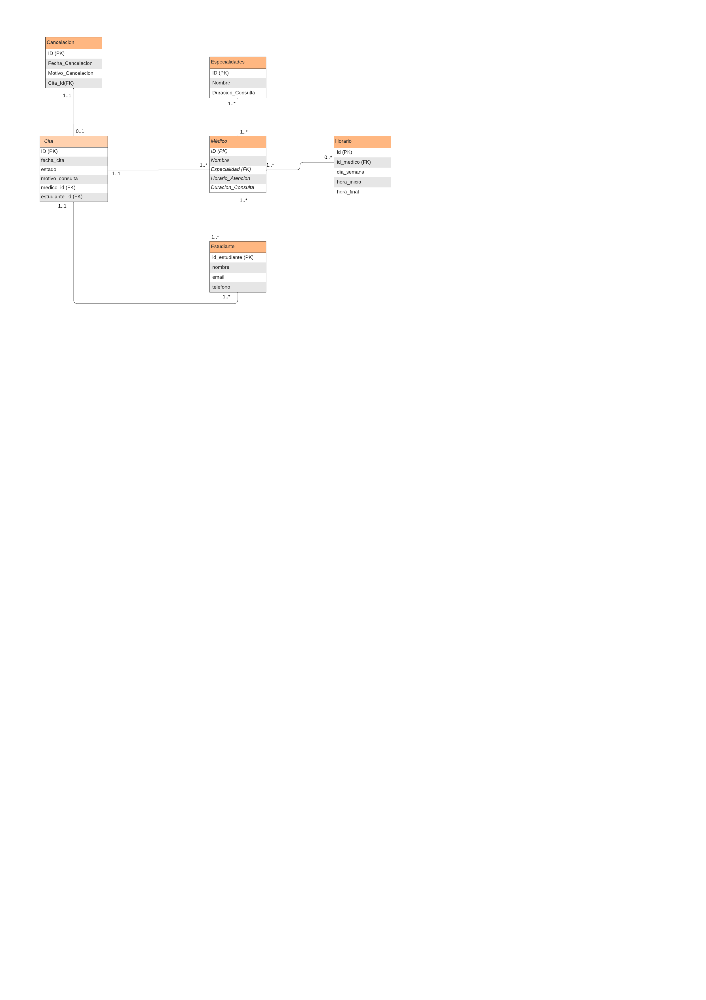

# Documentación de la Base de Datos en Proyecto Citas

## Base de Datos Utilizada

Para el proyecto **ProyectoCitas**, se utilizó una base de datos **PostgreSQL**. PostgreSQL fue elegida por su fiabilidad, capacidad de manejar grandes volúmenes de datos y su integración nativa con Spring Boot.

## Estructura de la Base de Datos

La estructura de la base de datos se centra en varias tablas relacionadas que almacenan la información necesaria para gestionar las citas médicas. A continuación se describe cada tabla:

- **Appointment**

  - `id`: Clave primaria de tipo SERIAL.
  - `appointment_date`: Fecha de la cita, tipo DATE.
  - `consultation_reason`: Motivo de la consulta, tipo TEXT.
  - `status`: Estado de la cita, tipo VARCHAR.
  - `doctor_id`: Clave foránea hacia la tabla Doctor.
  - `student_id`: Clave foránea hacia la tabla Students.

- **Doctor**

  - `id`: Clave primaria de tipo SERIAL.
  - `name`: Nombre del médico, tipo VARCHAR(100).
  - `specialty_id`: Clave foránea hacia la tabla Specialties.
  - `consultation_time`: Tiempo estimado de atención por consulta, tipo INTEGER.
  - `consultation_duration`: Duración de la consulta en minutos, tipo INTEGER.

- **Students**

  - `student_id`: Clave primaria de tipo SERIAL.
  - `name`: Nombre del estudiante, tipo VARCHAR(100).
  - `email`: Correo electrónico del estudiante, tipo VARCHAR(100).
  - `phone`: Número de teléfono del estudiante, tipo VARCHAR(20).

- **Specialties**

  - `id`: Clave primaria de tipo SERIAL.
  - `name`: Nombre de la especialidad médica, tipo VARCHAR(100).
  - `consultation_duration`: Duración estimada de las consultas de esta especialidad, tipo INTEGER.

- **Schedule**

  - `id`: Clave primaria de tipo SERIAL.
  - `doctor_id`: Clave foránea hacia la tabla Doctor.
  - `day_of_week`: Día de la semana, tipo VARCHAR.
  - `start_time`: Hora de inicio de atención, tipo TIME.
  - `end_time`: Hora de finalización de atención, tipo TIME.

- **Cancellation**
  - `id`: Clave primaria de tipo SERIAL.
  - `cancellation_date`: Fecha de la cancelación de la cita, tipo DATE.
  - `cancellation_reason`: Motivo de la cancelación, tipo TEXT.
  - `appointment_id`: Clave foránea hacia la tabla Appointment.

Cada columna está configurada con tipos de datos específicos de PostgreSQL, optimizando el almacenamiento para cada tipo de información.

## Configuración de la Base de Datos

### Configuración Individual en PostgreSQL

Cada usuario debe configurar la base de datos PostgreSQL en su propia máquina. A continuación, se detallan los pasos básicos para la instalación (recomendamos la utilización de PGAdmin4):

1. **Instalar PostgreSQL**: Para poder instalar Postgre, se puede descargar desde [https://www.postgresql.org/download/](https://www.postgresql.org/download/) y seguir las instrucciones dependiendo del sistema operativo.
2. **Crear la Base de Datos y el Usuario**:
   - Iniciar sesión en PostgreSQL con un usuario administrador.
   - Ejecuta los siguientes comandos para crear la base de datos `citas` y un usuario con permisos:
     ```sql
     CREATE DATABASE citas;
     CREATE USER citas_user WITH PASSWORD 'tu_contraseña';
     GRANT ALL PRIVILEGES ON DATABASE citas TO citas_user;
     ```
3. **Configurar Acceso Local**: Asegúrate de que el archivo `pg_hba.conf` permite conexiones locales para el usuario `citas_user`.

## Configuración en Spring Boot

La configuración de la base de datos en Spring Boot sigue el estándar de uso de archivos externos y la carga de variables sensibles desde un archivo `.env`. Para mantener los datos sensibles fuera del código fuente, se utiliza la biblioteca `dotenv`, que carga las variables de entorno en tiempo de ejecución. En la raíz del proyecto, se agrega el archivo `.env` con las siguientes variables:

```env
  DB_HOST=localhost
  DB_PORT=5432
  DB_NAME=jdbo:postgresql://localhost:5432/citas
  DB_USER=postgres
  DB_PASSWORD=1234
```

## Configuración en `application.yml`

El archivo `application.yml` define las propiedades de conexión a PostgreSQL. Las configuraciones incluyen:

- `driver-class-name`: `org.postgresql.Driver`
- `spring.datasource`: Se establece usando las variables de entorno para la URL, nombre de usuario, y contraseña.

Además, se configura Hibernate con la propiedad `ddl-auto: update` para actualizar automáticamente el esquema de la base de datos basado en cambios en las entidades JPA.

Esta configuración garantiza que el esquema de la base de datos se mantenga sincronizado con el modelo de datos de la aplicación y que las tablas se creen o actualicen automáticamente.

## Estándares de Inicialización de la Base de Datos

Como estándar, el proyecto implementa un componente `DatabaseInitializer` que usa `JdbcTemplate` para verificar y crear las tablas necesarias si aún no existen. Este componente asegura que la base de datos esté disponible al iniciar la aplicación y sigue las convenciones de Spring Boot, separando la lógica de inicialización de la lógica de la aplicación.

La estructura del código y la organización en clases y archivos de configuración permiten que el proyecto sea escalable y fácil de mantener, alineándose con estándares de desarrollo de aplicaciones de alta disponibilidad y orientadas a microservicios.


## Diagrama Entidad Relación 

