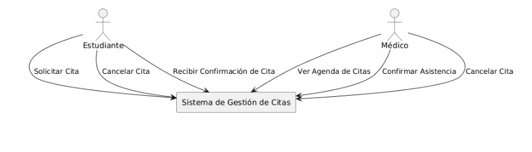
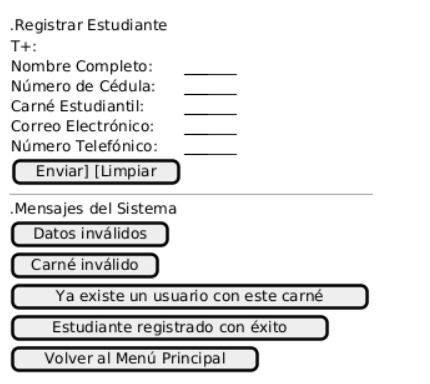
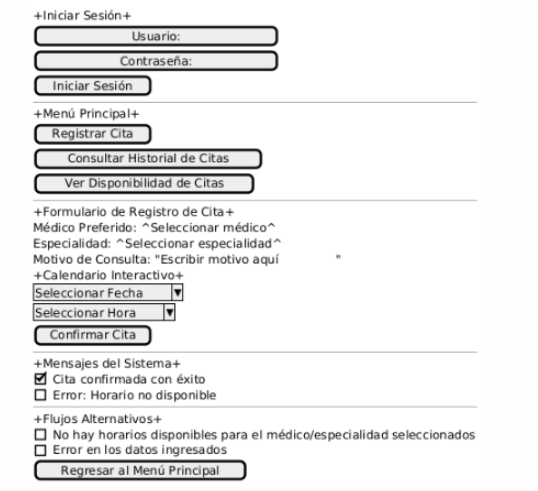
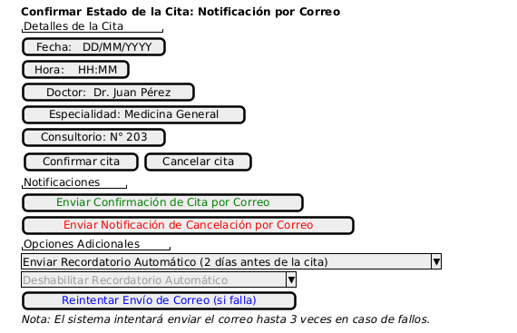
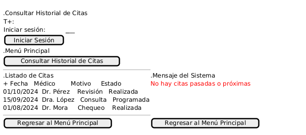
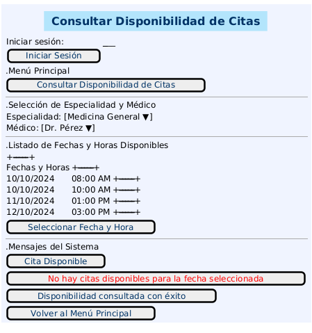
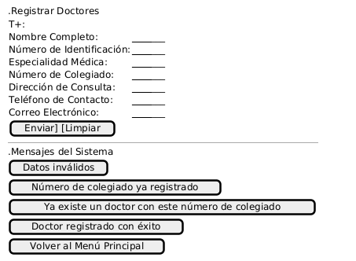
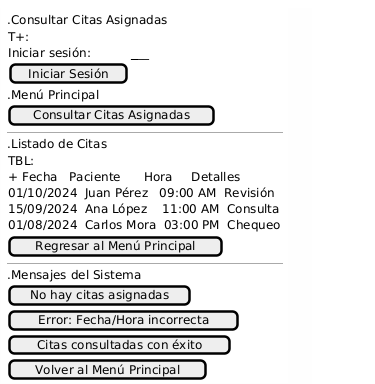

# Sistema de control de citas médicas

## Descripción del problema

En la clínica universitaria contamos con un total de 5 médicos, distribuidos de la siguiente manera: dos médicos generales, el Dr. Juan Pérez y la Dra. Ana López; un pediatra, el Dr. Carlos Fernández; una ginecóloga, la Dra. Laura Gómez; y un especialista en medicina interna, el Dr. Roberto Martínez. Los horarios de estos médicos varían: el Dr. Juan Pérez trabaja de lunes a viernes de 8:00 AM a 12:00 PM y de lunes a jueves de 2:00 PM a 5:00 PM, mientras que la Dra. Ana López tiene el mismo horario matutino pero atiende por la tarde solo de lunes a miércoles de 2:00 PM a 5:00 PM. Por su parte, el Dr. Carlos Fernández atiende a pacientes de pediatría los lunes, miércoles y viernes de 9:00 AM a 1:00 PM y los martes y jueves de 3:00 PM a 6:00 PM. La Dra. Laura Gómez recibe consultas de ginecología los lunes y miércoles de 8:00 AM a 12:00 PM y los martes y jueves de 1:00 PM a 4:00 PM. Finalmente, el Dr. Roberto Martínez trabaja en medicina interna los lunes, miércoles y viernes de 10:00 AM a 2:00 PM y los martes y jueves de 2:00 PM a 6:00 PM.

Con un sistema automatizado basado en correos electrónicos, donde se validaría la disponibilidad en tiempo real, se evitarían citas duplicadas y se ofrecería una mayor comodidad al estudiante. Al recibir la solicitud por correo, el sistema gestionaría automáticamente la cita, enviando confirmaciones y recordatorios sin intervención manual. Al momento de sacar una cita, el estudiante deberá proporcionar algunos datos básicos. Estos incluirían el nombre completo, número de estudiante, correo electrónico, motivo de la consulta, preferencia de médico o especialidad y su disponibilidad de horarios. Esta información permitiría validar la identidad del estudiante y asignar la cita de manera eficiente, asegurando que se maneje de forma segura en el sistema.

El rango de duración entre citas es variable. Para los médicos generales, como el Dr. Juan Pérez y la Dra. Ana López, cada consulta dura entre 20 y 30 minutos, con un intervalo de 10 minutos entre citas. Para los especialistas, como el Dr. Carlos Fernández en pediatría, la Dra. Laura Gómez en ginecología y el Dr. Roberto Martínez en medicina interna, la consulta puede durar entre 30 y 40 minutos, con 10 a 15 minutos entre cada paciente para la documentación y preparación.

La cancelación de citas en este sistema también sería sencilla. El estudiante enviaría su solicitud de cancelación mediante la plataforma web. El sistema verificaría automáticamente los detalles de la cita y, si es válido, cancelaría la cita, actualizando el calendario en tiempo real para liberar el espacio. Una vez completada la cancelación, el estudiante recibiría un correo de confirmación. El sistema gestionaría todo sin intervención humana, y los horarios cancelados estarían disponibles de inmediato para otros estudiantes que deseen reservarlos.

Al momento de agendar una cita, el estudiante utilizará un calendario interactivo en tiempo real. Tras ingresar a la plataforma, seleccionará la especialidad o el médico que desea ver, y el sistema desplegará un calendario con los días y horas disponibles. Los horarios ocupados aparecerán desactivados, y el estudiante solo podrá seleccionar las franjas horarias disponibles. Una vez seleccionada la cita, el sistema la confirmará y enviará un correo con todos los detalles.

# Requerimientos funcionales

## **Estudiante**

**RF-01: Registrar Estudiante**

- _Descripción_: El estudiante se registra en el sistema ingresando su nombre completo, teléfono, correo institucional, dirección de residencia, fecha de nacimiento, número de identificación y carnet que valida que es estudiante.
- _Problema que resuelve_: Permite validar que los usuarios que acceden al sistema son estudiantes legítimos, garantizando que solo ellos puedan programar citas médicas.
- _Actores_: Estudiante - Sistema

**RF-02: Registrar Citas**

- _Descripción_: El estudiante registra la cita según lo requiera, con la fecha, hora y doctor con la especialidad que necesite.
- _Problema que resuelve_: Facilita la programación de citas médicas, asegurando que los estudiantes puedan seleccionar el médico y el horario disponible según su conveniencia, evitando la necesidad de contacto manual con la clínica.
- _Actores_: Estudiante - Sistema

**RF-03: Cancelar la Cita**

- _Descripción_: El estudiante puede cancelar la cita con un periodo máximo de 24 horas de antelación, siempre y cuando exista dicha cita en su historial.
- _Problema que resuelve_: Ofrece a los estudiantes la flexibilidad de cancelar citas sin intervención humana, lo que libera automáticamente el horario para otros usuarios. Además, asegura que las cancelaciones se hagan con suficiente antelación para una correcta gestión del calendario.
- _Actores_: Estudiante - Sistema

**RF-04: Confirmar Estado de la Cita (Notificación por Correo)**

- _Descripción_: Al realizar o cancelar una cita, el estudiante recibirá una notificación por correo electrónico confirmando o cancelando la cita. Esta notificación incluirá detalles como fecha, hora, doctor, especialidad y número de consultorio. Además, el estudiante recibirá un recordatorio dos días antes de la fecha de la cita.
- _Problema que resuelve_: Asegura que los estudiantes estén informados en tiempo real del estado de sus citas, ya sea confirmación, cancelación o recordatorio, mejorando la comunicación y evitando ausencias inesperadas.
- _Actores_: Estudiante - Sistema

**RF-05: Consultar Historial de Citas**

- _Descripción_: El estudiante puede consultar el historial de sus citas, tanto pasadas como futuras.
- _Problema que resuelve_: Proporciona a los estudiantes acceso rápido y sencillo a su historial de citas, permitiéndoles revisar detalles de citas pasadas y futuras sin necesidad de contactar directamente con la clínica.
- _Actores_: Sistema - Estudiante - Doctor

**RF-06: Consultar la Disponibilidad de Citas**

- _Descripción_: El estudiante selecciona la fecha y hora disponibles según el doctor y la especialidad previamente elegidos.
- _Problema que resuelve_: Facilita la búsqueda de citas disponibles según la especialidad o doctor preferido, permitiendo al estudiante seleccionar un horario acorde a su disponibilidad sin la intervención del personal administrativo.
- _Actores_: Sistema - Estudiante - Doctor

---

## **Doctor**

**RF-07: Registrar Doctores**

- _Descripción_: El doctor se registra en el sistema proporcionando su información personal y la especialidad a la que pertenece.
- _Problema que resuelve_: Asegura que solo los doctores registrados en el sistema puedan brindar sus servicios, garantizando la validez de los datos médicos y su acceso a la gestión de citas.
- _Actores_: Doctor - Sistema

**RF-08: Modificar su Horario de Trabajo**

- _Descripción_: El doctor puede ajustar su propio horario de trabajo según su disponibilidad.
- _Problema que resuelve_: Da flexibilidad al doctor para ajustar su horario de trabajo en función de su disponibilidad y compromisos, sin requerir la intervención de terceros.
- _Actores_: Doctor - Sistema

**RF-09: Consultar su Horario de Trabajo**

- _Descripción_: El doctor puede consultar su horario de trabajo de manera rápida y sencilla.
- _Problema que resuelve_: Permite a los doctores revisar su agenda de forma rápida y sencilla, garantizando que estén al tanto de sus horarios y citas asignadas, optimizando la organización de su tiempo.
- _Actores_: Doctor - Sistema

**RF-10: Consultar las Citas Asignadas**

- _Descripción_: El doctor puede consultar las citas que le han sido asignadas, ya sea por día o por semana, para planificar su carga de trabajo.
- _Problema que resuelve_: Proporciona a los doctores una vista clara de las citas asignadas, permitiéndoles planificar con antelación y gestionar mejor su carga de trabajo.
- _Actores_: Doctor - Sistema

**RF-11: Modificar Citas de su Agenda**

- _Descripción_: El doctor puede modificar citas previamente registradas en su agenda.
- _Problema que resuelve_: Otorga a los doctores la capacidad de ajustar citas en caso de cambios o imprevistos, asegurando que se mantenga la comunicación y que el estudiante sea notificado de manera oportuna.
- _Actores_: Doctor - Sistema

**RF-12: Cancelar Cita de su Agenda**

- _Descripción_: El doctor tiene la capacidad de cancelar una cita en caso de ser necesario, liberando el horario correspondiente.
- _Problema que resuelve_: Permite a los doctores cancelar citas por razones justificadas, liberando el espacio en el calendario y evitando que el estudiante pierda tiempo en una cita que no se llevará a cabo.
- _Actores_: Doctor - Sistema

---

# Requerimientos suplementarios

**RNF-01**

- _Descripción_: El sistema debe garantizar la disponibilidad y actualización en tiempo real del calendario de citas.
- _Problema que resuelve_: El sistema gestionará la disponibilidad de citas en tiempo real para evitar duplicaciones y asegurar que los horarios cancelados estén inmediatamente disponibles para otros estudiantes. Esto requiere que el sistema sea capaz de actualizar la disponibilidad de las citas de forma instantánea y precisa cada vez que se realiza, modifica o cancela una cita.
- _Categoría_: Performance
- _Subcategoría_: Tiempo de respuesta (Response Time)

**RNF-02**

- _Descripción_: El sistema debe enviar notificaciones por correo electrónico al estudiante dentro de los 5 minutos posteriores a la confirmación o cancelación de una cita.
- _Problema que resuelve_: El sistema automatizado se basa en el envío de correos electrónicos para la confirmación, recordatorios y cancelación de citas. Para garantizar una buena experiencia de usuario y asegurar la eficiencia del sistema, es necesario que las notificaciones se envíen en un tiempo razonable tras la acción del estudiante, asegurando que reciba una respuesta rápida respecto a sus citas.
- _Categoría_: Usabilidad
- _Subcategoría_: Accesibilidad

---

# Diagrama de contexto

# Diagrama de casos de uso

# Actores

## Actor Miniatura

Actor: **E01-Estudiante**

#### Tipo de Actor y Estereotipo

Este actor representa a los estudiantes en el sistema de gestión de citas médicas.

#### Descripción del Actor

El actor estudiante interactúa con el sistema para realizar varias acciones relacionadas con la programación y consulta de citas médicas. El estudiante puede registrar nuevas citas, cancelar citas, consultar el historial de citas y verificar la disponibilidad de citas según la especialidad o el médico de su preferencia. Además, el estudiante recibe notificaciones por correo electrónico para confirmar, cancelar o recordar sus citas, mejorando la experiencia y evitando ausencias inesperadas. El estudiante necesita un número de identificación y un carnet de estudiante válido para acceder al sistema.

#### Relaciones del Actor

Este actor está relacionado con los siguientes casos de uso:

- **UC01:** Registrar cita médica
- **UC02:** Cancelar cita médica
- **UC03:** Consultar historial de citas
- **UC04:** Confirmar estado de la cita (notificación por correo)
- **UC05:** Consultar disponibilidad de citas

#### Especificaciones de Interfaz

- **U10:** FormularioRegistroEstudiante
- **I200:** ServicioCorreoNotificaciones

---

## Actor Miniatura

Actor: **D01-Doctor**

#### Tipo de Actor y Estereotipo

Este actor representa a los doctores en el sistema de gestión de citas médicas.

#### Descripción del Actor

El actor doctor interactúa con el sistema para gestionar su agenda de citas, consultar su horario de trabajo, modificar o cancelar citas asignadas, y ajustar su disponibilidad de acuerdo con sus compromisos profesionales. También puede ver las citas programadas por los estudiantes y hacer cambios en caso de situaciones imprevistas. El doctor necesita credenciales válidas (nombre de usuario y contraseña) para acceder al sistema, y su perfil está registrado con una especialidad médica.

#### Relaciones del Actor

Este actor está relacionado con los siguientes casos de uso:

- **UC07:** Registrar doctores
- **UC08:** Modificar su horario de trabajo
- **UC09:** Consultar su horario de trabajo
- **UC10:** Consultar citas asignadas
- **UC11:** Modificar cita en su agenda
- **UC12:** Cancelar cita en su agenda

#### Especificaciones de Interfaz

**U110:** FormularioRegistroDoctor
**I900:** SistemaDeCitasClínicasUniversitarias

---

# Casos de uso

## CU-01RF-01: Registrar Estudiante

### Descripción

Este caso de uso permite registrar a un estudiante en el sistema proporcionando su información personal y carné universitario para poder hacer uso del sistema de gestión de citas de la clínica universitaria.

### Actores

- Estudiante
- Sistema

### Precondiciones

- El estudiante debe tener acceso al sistema y tener un carné universitario vigente.

### Postcondiciones

- El estudiante queda registrado correctamente en el sistema.

### Flujo Principal

1. El estudiante accede al sistema.
2. El sistema muestra la opción “Registrar Estudiantes”.
3. El estudiante selecciona la opción “Registrar Estudiantes”.
4. El sistema muestra el formulario de registro con la información personal solicitada (nombre completo, número de cédula, carné estudiantil, correo electrónico, número telefónico).
5. El estudiante completa el formulario.
6. El sistema valida los datos ingresados y verifica que el carné estudiantil no esté duplicado.
7. El sistema registra correctamente al estudiante.

### Flujo Alternativo

#### FA-01: Datos requeridos no válidos

1. El sistema muestra un mensaje de error indicando los campos con datos inválidos.
2. El estudiante corrige los datos y vuelve a enviarlos.

#### FA-02: Carné estudiantil duplicado

1. El sistema muestra un mensaje de error indicando que el carné estudiantil ingresado ya existe.
2. El estudiante modifica el carné y el sistema lo valida nuevamente.

### Escenarios de Prueba

| **Entrada**                                       | **Salida esperada**                                                                               |
| ------------------------------------------------- | ------------------------------------------------------------------------------------------------- |
| Estudiante completa la información requerida.     | El sistema registra al estudiante correctamente.                                                  |
| Estudiante omite un campo obligatorio.            | El sistema muestra un mensaje de error indicando los datos que son inválidos.                     |
| Estudiante ingresa un carné estudiantil inválido. | El sistema muestra un mensaje de error indicando que el carné estudiantil ingresado no es válido. |

#### Eequerimientos Especiales

- El carné estudiantil debe ser valido.
- El carné estudiantil no debe de estar duplicado en el sistema.

### Prototipo:

#### Autor:

- Luis Daniel Solano

---

## CU-01RF-02: Registrar Citas Médicas

### Descripción

Este caso de uso permite que un estudiante registre una cita médica en el sistema de gestión de citas de la clínica universitaria, seleccionando la especialidad o médico de preferencia y la fecha y hora disponibles, validando la disponibilidad en tiempo real.

### Actores

- Estudiante
- Sistema de Gestión de Citas

### Precondiciones

- El estudiante debe estar registrado y autenticado en el sistema.
- Debe haber disponibilidad en el horario del médico o especialidad seleccionada.

### Postcondiciones

- La cita se registra correctamente en el sistema.
- El estudiante recibe una confirmación de la cita por correo electrónico.
- El sistema envía recordatorios automáticos antes de la cita.

### Flujo Principal

1. El estudiante accede al sistema.
2. El sistema verifica las credenciales y muestra el menú principal.
3. El estudiante selecciona la opción "Registrar Cita".
4. El sistema muestra un formulario con opciones como médico preferido, especialidad, motivo de consulta y disponibilidad de horarios.
5. El estudiante selecciona el horario y confirma la cita.
6. El sistema valida y confirma la cita, enviando un correo al estudiante.

### Flujo Alternativo

#### FA-01: No hay horarios disponibles

1. El sistema muestra un mensaje indicando la falta de disponibilidad.
2. El estudiante selecciona otra especialidad o regresa al menú principal.

## Prototipo

## Requerimientos Especiales

1. **Notificaciones Automáticas**: El sistema debe enviar recordatorios automáticos al estudiante, por correo electrónico, con al menos 24 horas de anticipación a la cita.

2. **Accesibilidad Multidispositivo**: El sistema debe ser accesible desde diferentes dispositivos (computadoras, tabletas y teléfonos móviles) para que los estudiantes puedan registrar sus citas desde cualquier lugar.

3. **Validación en Tiempo Real**: La disponibilidad de horarios debe actualizarse en tiempo real para evitar que varios estudiantes seleccionen el mismo horario.

4. **Historial de Citas**: El sistema debe almacenar un historial de todas las citas agendadas por el estudiante, accesible desde su perfil.

5. **Interfaz de Usuario Intuitiva**: El sistema debe contar con una interfaz amigable y fácil de usar, con accesibilidad para personas con discapacidades, cumpliendo con las normativas de accesibilidad web (WCAG).

---

## Escenarios de Prueba

| **Entrada**                     | **Acción**                                                | **Resultado Esperado**                                        |
| ------------------------------- | --------------------------------------------------------- | ------------------------------------------------------------- |
| Credenciales válidas            | El estudiante accede al sistema                           | Se muestra el menú principal                                  |
| Información de cita completa    | El estudiante completa el formulario                      | El sistema muestra los horarios disponibles                   |
| Horario disponible seleccionado | El estudiante selecciona un horario y confirma            | El sistema confirma la cita y envía un correo electrónico     |
| Médico/especialidad sin horario | El estudiante selecciona un médico sin horario disponible | El sistema muestra un mensaje de no disponibilidad            |
| Horario inválido                | El estudiante selecciona un horario no disponible         | El sistema muestra un mensaje de error indicando el conflicto |
| Datos inválidos                 | El estudiante introduce datos incompletos o incorrectos   | El sistema muestra un mensaje de error y solicita corrección  |

### Autores:

- Mariano Durán

---

## CU-01RF-03: Cancelar Cita

### Descripción

Este caso de uso permite que un estudiante cancele una cita médica previamente registrada en el sistema.

### Actores

- Estudiante
- Sistema

### Precondiciones

- El estudiante debe estar registrado y autenticado en el sistema.
- Debe existir una cita agendada.

### Postcondiciones

- La cita se cancela correctamente y se actualiza el calendario del doctor.
- El estudiante recibe una confirmación de cancelación por correo electrónico.

### Flujo Principal

1. El estudiante accede al sistema con sus credenciales.
2. El sistema muestra el menú principal.
3. El estudiante selecciona la opción "Consultar Citas Agendadas".
4. El sistema muestra las citas agendadas.
5. El estudiante selecciona la cita a cancelar.
6. El sistema solicita la confirmación de cancelación.
7. El estudiante confirma y el sistema cancela la cita, enviando una notificación.

### Flujo Alternativo

#### FA-01: Cancelación fuera del plazo permitido

1. El sistema muestra un mensaje indicando que la cita no puede ser cancelada por estar fuera del plazo permitido.
2. El estudiante regresa al menú principal.

## Prototipo

## Requerimientos Especiales

1. **Notificación automática**: Cuando la cita es cancelada, se envía una notificación por correo electrónico al estudiante sobre la cancelación o cualquier modificación en su cita.
2. **Registro en historial**: La cancelación es registrada en el historial del doctor para referencia futura.

---

## Escenarios de Prueba

| **Entrada**                      | **Acción**                                                | **Resultado Esperado**                                                                            |
| -------------------------------- | --------------------------------------------------------- | ------------------------------------------------------------------------------------------------- |
| Credenciales válidas             | El estudiante accede al sistema                           | Se muestra el menú principal                                                                      |
| Sin citas en el día seleccionado | El estudiante consulta sus citas                          | Mensaje: “No hay citas asignadas para el rango seleccionado”                                      |
| Cita con fecha mal asignada      | El estudiante consulta sus citas                          | Mensaje de error por fecha incorrecta y opción de corregir o eliminar la cita                     |
| Selección de rango de tiempo     | El estudiante selecciona “Consultar Citas” para la semana | El sistema muestra todas las citas de la semana con nombre del doctor, horario, motivo y duración |

---

## Autor:

- Jesús Alonso Fuentes Condega

---

## CU-01RF-04: Confirmar Estado de la Cita (Notificación por Correo)

### Descripción

Este caso de uso permite que el sistema envíe una notificación por correo electrónico al estudiante cuando realiza o cancela una cita. También envía recordatorios automáticos dos días antes de la cita.

### Actores

- Estudiante
- Sistema

### Precondiciones

- El estudiante debe tener una cita registrada en el sistema.
- El correo electrónico debe ser válido.

### Postcondiciones

- El estudiante recibe notificaciones de confirmación, cancelación o recordatorio de la cita.

### Flujo Principal

1. El estudiante realiza una acción en el sistema (programar o cancelar una cita).
2. El sistema genera una notificación y la envía al correo del estudiante con los detalles de la cita.
3. Dos días antes de la cita, el sistema envía un recordatorio.

### Flujo Alternativo

#### FA-01: Error en el envío del correo

1. El sistema reintenta el envío hasta tres veces.
2. Si falla, notifica al equipo técnico.

### Prototipo

## Requerimientos Especiales

- El sistema debe enviar correos electrónicos con un formato estándar que incluya los detalles de la cita.
- El sistema debe manejar reintentos automáticos en caso de errores al enviar los correos.

---

## Escenarios de Prueba

| **Entrada**        | **Acción**            | **Resultado esperado**                                                      |
| ------------------ | --------------------- | --------------------------------------------------------------------------- |
| Cita agendada      | Envío de confirmación | El estudiante recibe un correo de confirmación con los detalles de la cita. |
| Cita cancelada     | Envío de cancelación  | El estudiante recibe un correo notificando la cancelación de la cita.       |
| Cita agendada      | Envío de recordatorio | El estudiante recibe un recordatorio 2 días antes de la cita programada.    |
| Error en el correo | Reintento de envío    | El sistema intenta reenviar el correo hasta tres veces antes de fallar.     |

### Autor:

- Randall Vargas

---

## CU-01RF-05: Consultar Historial de Citas

### Descripción

Este caso de uso permite que un estudiante consulte su historial de citas en el sistema de gestión de citas médicas.

### Actores

- Estudiante
- Sistema

### Precondiciones

- El estudiante debe estar registrado y autenticado en el sistema.
- Debe haber citas registradas en su historial.

### Postcondiciones

- El estudiante puede visualizar sus citas pasadas y futuras.

### Flujo Principal

1. El estudiante accede al sistema.
2. El sistema muestra la opción de "Consultar Historial de Citas".
3. El estudiante selecciona la opción.
4. El sistema muestra la lista de citas pasadas y futuras con detalles como fecha, médico y estado.

### Flujo Alternativo

#### FA-01: Historial vacío

1. El sistema muestra un mensaje indicando que no hay citas registradas.
2. El estudiante regresa al menú principal.

### Prototipo

## Escenarios de Prueba

| **Entrada**                              | **Acción**                                   | **Resultado Esperado**                                               |
| ---------------------------------------- | -------------------------------------------- | -------------------------------------------------------------------- |
| El estudiante tiene citas registradas    | El estudiante consulta el historial de citas | El sistema muestra la lista de citas pasadas y próximas.             |
| El estudiante no tiene citas registradas | El estudiante consulta el historial de citas | El sistema muestra un mensaje indicando que no se encontraron citas. |

### Autor:

- Melanie Campos Guevara

---

## CU-01RF-06: Consultar Disponibilidad de Citas

### Descripción

Este caso de uso permite que un estudiante consulte la disponibilidad de citas médicas según la especialidad o doctor elegido.

### Actores

- Estudiante
- Sistema
- Doctor

### Precondiciones

- El estudiante debe estar registrado y autenticado en el sistema.
- El estudiante debe seleccionar una especialidad o doctor.

### Postcondiciones

- El sistema muestra la disponibilidad de horarios para la especialidad o doctor seleccionado.

### Flujo Principal

1. El estudiante accede al sistema.
2. El sistema muestra la opción "Consultar Disponibilidad de Citas".
3. El estudiante selecciona una especialidad o doctor.
4. El sistema muestra un calendario con los horarios disponibles.
5. El estudiante selecciona un horario para reservar.

### Flujo Alternativo

#### FA-01: No hay disponibilidad

1. El sistema muestra un mensaje indicando que no hay horarios disponibles.
2. El estudiante regresa al menú principal o selecciona otra especialidad.

### Prototipo

## Requerimientos Especiales

1. Solo los estudiantes registrados y autenticados pueden consultar la disponibilidad de citas en el sistema.
2. Los estudiantes deben identificar la especialidad o el médico que desean consultar antes de verificar la disponibilidad de citas.
3. El sistema debe actualizar la disponibilidad de horarios en tiempo real, reflejando los cambios inmediatamente después de que un horario sea reservado por otro estudiante.

---

## Escenarios de Prueba

| **Escenario de Prueba**                                       | **Entrada**                                                                                   | **Salidas Esperadas**                                                                                            |
| ------------------------------------------------------------- | --------------------------------------------------------------------------------------------- | ---------------------------------------------------------------------------------------------------------------- |
| 1. Consultar disponibilidad sin autenticación                 | Estudiante no autenticado intenta acceder a la consulta de disponibilidad                     | Mensaje de error: "Debe iniciar sesión para consultar la disponibilidad de citas."                               |
| 2. Consultar disponibilidad con sesión iniciada               | Estudiante autenticado selecciona especialidad y médico                                       | Se muestra la pantalla con el calendario de citas disponibles para la especialidad/médico seleccionado.          |
| 3. Seleccionar especialidad sin identificar médico            | Estudiante autenticado selecciona especialidad pero no médico                                 | Mensaje de error: "Debe seleccionar un médico antes de verificar disponibilidad."                                |
| 4. Seleccionar fecha y hora con disponibilidad                | Estudiante autenticado selecciona una fecha y hora donde hay disponibilidad                   | Se muestran las horas disponibles con opción para continuar con la reserva.                                      |
| 5. Seleccionar fecha y hora sin disponibilidad                | Estudiante autenticado selecciona una fecha y hora donde no hay disponibilidad                | Mensaje: "No hay citas disponibles en la fecha y hora seleccionadas."                                            |
| 6. Actualización en tiempo real de la disponibilidad de citas | Otro estudiante reserva una cita en el horario seleccionado justo antes del estudiante actual | La disponibilidad de la cita se actualiza automáticamente, y el horario deja de estar disponible en la interfaz. |

---

### Autor:

- Wanda Granados

---

## CU-01RF-07: Registrar Doctores

### Descripción

Este caso de uso permite registrar a un doctor en el sistema para que pueda brindar su servicio de salud, proporcionando su información personal y el área especializada.

### Actores

- Doctor
- Sistema

### Precondiciones

- El doctor debe estar registrado en el sistema.

### Postcondiciones

- El doctor queda registrado correctamente en el sistema.

### Flujo Principal

1. El doctor accede al sistema.
2. El sistema muestra la opción "Registrar Doctores".
3. El doctor selecciona la opción y completa el formulario con su información personal y especialidad.
4. El sistema valida los datos ingresados.
5. El sistema registra al doctor en el sistema.

### Flujo Alternativo

#### FA-01: Datos inválidos

1. El sistema muestra un mensaje indicando los campos que contienen errores.
2. El doctor corrige los datos y los envía nuevamente.

### Prototipo

## Requerimientos Especiales

1. El número de colegiado debe ser único en el sistema.

---

## Escenarios de Prueba

| **Entrada**                                         | **Salida esperada**                                                                  |
| --------------------------------------------------- | ------------------------------------------------------------------------------------ |
| Doctor completa todos los campos correctamente      | El sistema registra la información correctamente.                                    |
| Doctor omite un campo obligatorio                   | El sistema muestra un mensaje de error indicando los campos faltantes.               |
| Doctor ingresa un número de colegiado que ya existe | El sistema muestra un mensaje de error indicando duplicidad del número de colegiado. |

---

### Autor:

- Luis Diego Irola

---

## CU-01RF-08: Modificar Horario de Trabajo del Doctor

### Descripción

Este caso de uso permite que un doctor modifique su horario de trabajo en el sistema de gestión de citas.

### Actores

- Doctor
- Sistema

### Precondiciones

- El doctor debe estar registrado y autenticado en el sistema.

### Postcondiciones

- El horario del doctor se actualiza en el sistema.

### Flujo Principal

1. El doctor accede al sistema.
2. El sistema muestra la opción "Modificar Horario de Trabajo".
3. El doctor selecciona la opción y ajusta los días y horas de su disponibilidad.
4. El sistema valida que no haya citas agendadas en los nuevos horarios.
5. El sistema guarda el nuevo horario.

### Flujo Alternativo

#### FA-01: Horarios en conflicto con citas existentes

1. El sistema muestra un mensaje indicando el conflicto de horarios.
2. El doctor ajusta los horarios o contacta con los pacientes afectados.

## Requerimientos Especiales

1. El sistema debe validar que los horarios introducidos no se sobrepongan con horarios ya existentes.
2. El sistema debe notificar automáticamente a los estudiantes si alguna de sus citas se ve afectada por el cambio de horario.

### Prototipo

## Escenarios de Prueba

| **Entrada**                     | **Acción**                                                                          | **Resultado Esperado**                                                  |
| ------------------------------- | ----------------------------------------------------------------------------------- | ----------------------------------------------------------------------- |
| Credenciales válidas            | El doctor accede al sistema                                                         | Se muestra el menú principal con las opciones disponibles.              |
| Información de horario completa | El doctor selecciona modificar horario y ajusta las horas disponibles               | El sistema guarda los nuevos horarios y muestra confirmación.           |
| Información de horario completa | El doctor intenta modificar un horario que tiene citas previamente agendadas        | El sistema muestra un mensaje de error indicando el conflicto.          |
| Médico sin horario asignado     | El doctor intenta modificar un horario cuando no tiene horas asignadas              | El sistema muestra un mensaje de error indicando la falta de horario.   |
| Horario inválido                | El doctor introduce horas fuera del rango permitido (por ejemplo, horas no válidas) | El sistema muestra un mensaje de error indicando datos inválidos.       |
| Datos incompletos               | El doctor no completa los campos necesarios para modificar el horario               | El sistema muestra un mensaje de error solicitando la corrección.       |
| Modificación exitosa            | El doctor selecciona horas válidas y sin conflicto                                  | El sistema actualiza el horario y notifica a los estudiantes afectados. |

### Autor:

- Jose Pablo Montero

---

## CU-01RF-09: Consultar Horario de Trabajo del Doctor

### Descripción

Este caso de uso permite que un doctor consulte su horario de trabajo en el sistema de gestión de citas.

### Actores

- Doctor
- Sistema

### Precondiciones

- El doctor debe estar registrado en el sistema.

### Postcondiciones

- El doctor visualiza su horario de trabajo actualizado.

### Flujo Principal

1. El doctor accede al sistema.
2. El sistema muestra la opción "Consultar Horario de Trabajo".
3. El doctor selecciona la opción y el sistema muestra su horario con día, hora y ubicación.

### Flujo Alternativo

#### FA-01: No tiene horario asignado

1. El sistema muestra un mensaje indicando que no hay horario asignado.
2. El doctor regresa al menú principal.

### Prototipo

## Escenarios de Prueba

| **Escenario**                            | **Acción**                                                     | **Resultado**                                                                                    |
| ---------------------------------------- | -------------------------------------------------------------- | ------------------------------------------------------------------------------------------------ |
| Credenciales válidas                     | El doctor accede al sistema                                    | Se muestra el menú principal.                                                                    |
| Sin horario asignado                     | El doctor consulta su horario de trabajo                       | Mensaje: "No tiene horario asignado".                                                            |
| Consulta de día u hora fuera del horario | El doctor consulta su horario para un día u hora no disponible | Mensaje de error: "Día u hora no disponible".                                                    |
| Selección de formato semanal             | El doctor selecciona "Consultar Horario" en formato semanal    | El sistema muestra el horario completo de la semana, con día, hora de inicio, fin y consultorio. |

---

## Requerimientos Especiales

1. El sistema debe permitir ver el horario tanto en formato semanal como diario.
2. El sistema debe actualizarse en tiempo real si hay cambios en el horario del doctor.

### Autor:

- Wanda Fuentes P

---

## CU-01RF-10: Consultar Citas Asignadas al Doctor

### Descripción

Este caso de uso permite que un doctor consulte las citas asignadas en su agenda según el día o la semana.

### Actores

- Doctor
- Sistema

### Precondiciones

- El doctor debe estar registrado en el sistema.
- Debe haber citas asignadas en su agenda.

### Postcondiciones

- El doctor puede ver las citas asignadas en el rango de tiempo seleccionado.

### Flujo Principal

1. El doctor accede al sistema.
2. El sistema muestra el menú principal.
3. El doctor selecciona la opción "Consultar Citas Asignadas".
4. El sistema muestra la lista de citas asignadas con detalles como nombre del paciente, fecha y hora.

### Flujo Alternativo

#### FA-01: No hay citas asignadas

1. El sistema muestra un mensaje indicando que no hay citas asignadas.
2. El doctor regresa al menú principal.

## Prototipo

## Requerimientos Especiales

1. El sistema debe notificar automáticamente al doctor sobre cambios en su agenda (cancelaciones, reprogramaciones) por correo electrónico.

---

## Escenarios de Prueba

| **Entrada**                      | **Acción**                                            | **Resultado esperado**                                                                                |
| -------------------------------- | ----------------------------------------------------- | ----------------------------------------------------------------------------------------------------- |
| Credenciales válidas             | El doctor accede al sistema                           | Se muestra el menú principal.                                                                         |
| Sin citas en el día seleccionado | El doctor consulta sus citas                          | Mensaje: "No hay citas asignadas para el rango seleccionado."                                         |
| Cita con fecha mal asignada      | El doctor consulta sus citas                          | Mensaje de error por fecha incorrecta y opción de corregir o eliminar la cita.                        |
| Selección de rango de tiempo     | El doctor selecciona "Consultar Citas" para la semana | El sistema muestra todas las citas de la semana, con nombre del paciente, horario, motivo y duración. |

---

### Autor:

- Sofía Mora Badilla

---

## CU-01RF-11: Modificar Citas en la Agenda del Doctor

### Descripción

Este caso de uso permite que un doctor modifique las citas ya registradas en su agenda dentro del sistema.

### Actores

- Doctor
- Sistema

### Precondiciones

- El doctor debe estar registrado y autenticado en el sistema.
- Debe existir al menos una cita asignada.

### Postcondiciones

- La cita modificada se actualiza en el sistema.
- El doctor recibe una confirmación de la modificación.

### Flujo Principal

1. El doctor accede al sistema con sus credenciales.
2. El sistema muestra el menú principal.
3. El doctor selecciona la opción "Consultar Citas Asignadas".
4. El sistema muestra la lista de citas.
5. El doctor selecciona la cita a modificar.
6. El sistema muestra un formulario para cambiar la fecha y hora.
7. El doctor confirma la modificación y el sistema valida los cambios.
8. El sistema actualiza la cita y envía una notificación al doctor.

### Flujo Alternativo

#### FA-01: Fecha/Hora no disponible

1. El sistema muestra un mensaje indicando que la fecha u hora seleccionada no está disponible.
2. El doctor selecciona otra fecha u hora disponible.

### Prototipo

## Requerimientos Especiales

1. El sistema debe notificar automáticamente al paciente sobre cambios en su cita (modificación de fecha, hora, o detalles) por correo electrónico.
2. Las modificaciones deben ser registradas en el historial del doctor para referencia futura.

---

## Escenarios de Prueba

| **Entrada**              | **Acción**                                   | **Resultado esperado**                                                                       |
| ------------------------ | -------------------------------------------- | -------------------------------------------------------------------------------------------- |
| Credenciales válidas     | El doctor accede al sistema                  | Se muestra el menú principal.                                                                |
| Cita existente           | El doctor selecciona una cita para modificar | El sistema muestra el formulario con los detalles de la cita para modificar.                 |
| Fecha/Hora no disponible | El doctor intenta modificar la cita          | El sistema muestra un mensaje de error indicando que la nueva fecha/hora no está disponible. |
| Modificación exitosa     | El doctor confirma los cambios               | El sistema actualiza los detalles de la cita y muestra un mensaje de confirmación de éxito.  |

---

### Autor:

- Joshua Rosales Figueroa

---

## CU-01RF-12: Cancelar Citas en la Agenda del Doctor

### Descripción

Este caso de uso permite que un doctor cancele una cita previamente registrada en su agenda dentro del sistema.

### Actores

- Doctor
- Sistema

### Precondiciones

- El doctor debe estar registrado y autenticado en el sistema.
- Debe existir al menos una cita asignada al doctor.

### Postcondiciones

- La cita es cancelada y eliminada del sistema.
- El paciente recibe una notificación de la cancelación.

### Flujo Principal

1. El doctor accede al sistema con sus credenciales.
2. El sistema muestra el menú principal.
3. El doctor selecciona la opción "Consultar Citas Asignadas".
4. El sistema muestra las citas asignadas.
5. El doctor selecciona la cita a cancelar.
6. El sistema muestra la opción para confirmar la cancelación.
7. El doctor confirma la cancelación y el sistema elimina la cita.
8. El paciente es notificado de la cancelación por correo electrónico.

### Flujo Alternativo

#### FA-01: No hay citas asignadas

1. El sistema muestra un mensaje indicando que no hay citas asignadas.
2. El doctor regresa al menú principal.

## Requerimientos Especiales

1. El sistema debe notificar automáticamente al paciente sobre la cancelación de su cita por correo electrónico.
2. Las cancelaciones deben ser registradas en el historial del doctor para referencia futura.

### Prototipo

## Escenarios de Prueba

| **Entrada**          | **Acción**                                  | **Resultado esperado**                                                      |
| -------------------- | ------------------------------------------- | --------------------------------------------------------------------------- |
| Credenciales válidas | El doctor accede al sistema                 | Se muestra el menú principal.                                               |
| Cita existente       | El doctor selecciona una cita para cancelar | El sistema muestra la opción de confirmación para cancelar la cita.         |
| Cita pasada          | El doctor intenta cancelar una cita pasada  | El sistema muestra un mensaje indicando que la cita no puede ser cancelada. |
| Cancelación exitosa  | El doctor confirma la cancelación           | El sistema elimina la cita y notifica tanto al doctor como al paciente.     |

---

### Autor:

- Claudia Ulloa Campabadal

