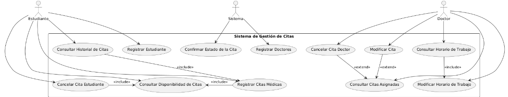
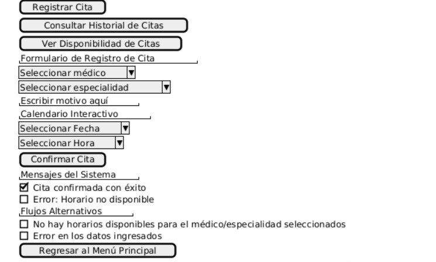
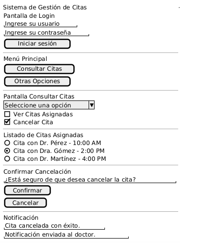
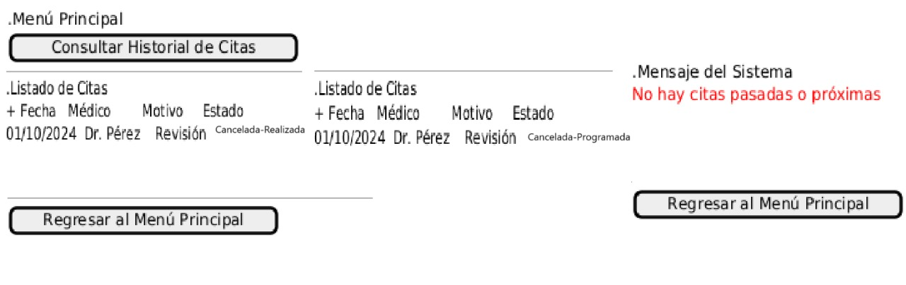
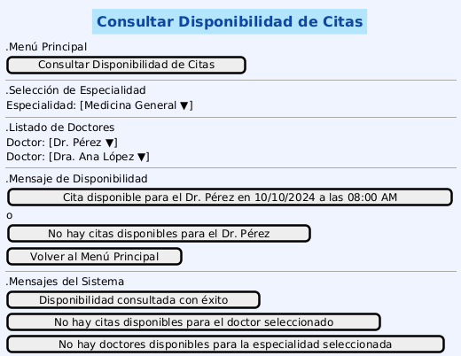
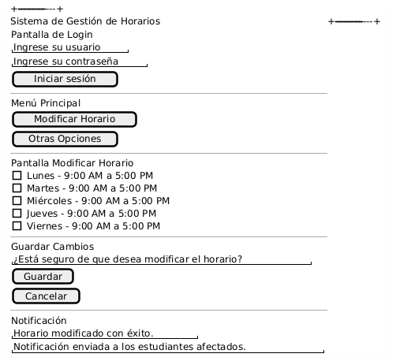
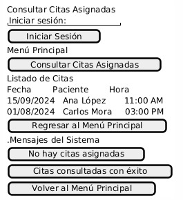
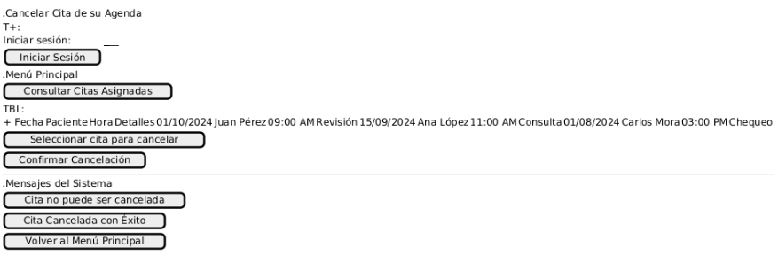

# Sistema de control de citas médicas

## Descripción del problema (Actualizado)

La clínica universitaria cuenta con cinco médicos que ofrecen diferentes especialidades: dos médicos generales (Dr. Juan Pérez y Dra. Ana López), un pediatra (Dr. Carlos Fernández), una ginecóloga (Dra. Laura Gómez) y un especialista en medicina interna (Dr. Roberto Martínez). Cada uno de ellos tiene horarios específicos para la atención de los estudiantes, lo que varía según la especialidad. Estos horarios deben ser gestionados de manera efectiva para evitar confusiones y asegurar una atención oportuna.

Actualmente, el proceso de gestión de citas es manual, y los estudiantes deben contactar a la clínica, ya sea presencialmente o por teléfono, para solicitar una consulta. Este sistema presenta varias limitaciones. Uno de los principales problemas es la falta de control sobre la disponibilidad en tiempo real, lo que lleva a que, en ocasiones, se otorguen citas duplicadas o en horarios que ya no están disponibles. Esto genera confusión y malestar tanto para los estudiantes como para los médicos.

Otro problema radica en la falta de flexibilidad para modificar o cancelar citas. Si un estudiante necesita cambiar o cancelar su cita, debe comunicarse nuevamente con la clínica, lo que no siempre es un proceso sencillo o rápido. Esto resulta en espacios desperdiciados, ya que las citas canceladas no son liberadas a tiempo para ser ocupadas por otros estudiantes.

Además, no existe un sistema claro y automatizado que permita a los estudiantes conocer los horarios disponibles de los médicos y elegir una franja horaria que se ajuste a sus necesidades. El proceso actual depende en gran medida de la disponibilidad del personal de la clínica para revisar los horarios manualmente y asignar una cita, lo que puede generar retrasos y falta de eficiencia.

El tiempo de las consultas también varía según la especialidad, lo que complica aún más la gestión de citas. Los médicos generales, por ejemplo, dedican entre 20 y 30 minutos por consulta, mientras que los especialistas requieren entre 30 y 40 minutos. Sin una adecuada planificación y control de estas diferencias, es común que se produzcan errores en la asignación de tiempos, lo que afecta tanto a los estudiantes como a los médicos.

Finalmente, el proceso actual de cancelación o modificación de citas es ineficiente, ya que no siempre se actualizan los calendarios en tiempo real, lo que puede generar confusión tanto para los médicos como para los estudiantes que intentan hacer nuevas reservas.

# Requerimientos funcionales (Actualizados)

## **Estudiante**

**RF-01: Registrar Estudiante**

- _Descripción: El estudiante se registra en el sistema ingresando su nombre completo, teléfono, correo institucional, dirección de residencia, fecha de nacimiento, número de identificación y carnet que valida que es estudiante.
- _Problema que resuelve: Permite validar que los usuarios que acceden al sistema son estudiantes legítimos, garantizando que solo ellos puedan programar citas médicas.
- _Actores: Estudiante - Sistema

**RF-02: Registrar Citas**

- _Descripción: El estudiante registra la cita según lo requiera, con la fecha, hora y doctor con la especialidad que necesite.
- _Problema que resuelve: Facilita la programación de citas médicas, asegurando que los estudiantes puedan seleccionar el médico y el horario disponible según su conveniencia, evitando la necesidad de contacto manual con la clínica.
- _Actores: Estudiante - Sistema

**RF-03: Cancelar la Cita**

- _Descripción: El estudiante puede cancelar la cita con un periodo máximo de 24 horas de antelación, siempre y cuando exista dicha cita en su historial.
- _Problema que resuelve: Ofrece a los estudiantes la flexibilidad de cancelar citas sin intervención humana, lo que libera automáticamente el horario para otros usuarios. Además, asegura que las cancelaciones se hagan con suficiente antelación para una correcta gestión del calendario.
- _Actores: Estudiante - Sistema

**RF-04: Notifica la confirmación de la cita**

- _Descripción: Al realizar o cancelar una cita, el estudiante recibirá una notificación por correo electrónico confirmando o cancelando la cita. Esta notificación incluirá detalles como fecha, hora, doctor, especialidad y número de consultorio. Además, el estudiante recibirá un recordatorio dos días antes de la fecha de la cita.
- _Problema que resuelve: Asegura que los estudiantes estén informados en tiempo real del estado de sus citas, ya sea confirmación, cancelación o recordatorio, mejorando la comunicación y evitando ausencias inesperadas.
- _Actores: Estudiante - Sistema

**RF-05: Consultar Historial de Citas**

- _Descripción_: El estudiante puede consultar el historial de sus citas, tanto pasadas como futuras.
- _Problema que resuelve_: Proporciona a los estudiantes acceso rápido y sencillo a su historial de citas, permitiéndoles revisar detalles de citas pasadas y futuras sin necesidad de contactar directamente con la clínica.
- _Actores_: Sistema - Estudiante

**RF-06: Consultar la Disponibilidad de Citas**

- _Descripción_: El estudiante selecciona la fecha y hora disponibles según el doctor y la especialidad previamente elegidos.
- _Problema que resuelve_: Facilita la búsqueda de citas disponibles según la especialidad o doctor preferido, permitiendo al estudiante seleccionar un horario acorde a su disponibilidad sin la intervención del personal administrativo.
- _Actores_: Sistema - Estudiante - Doctor

---

## **Doctor**

**RF-07: Registrar Doctores**

- _Descripción_: El doctor puede ajustar su propio horario de trabajo según su disponibilidad.
- _Problema que resuelve_: Asegura que solo los doctores registrados en el sistema puedan brindar sus servicios, garantizando la validez de los datos médicos y su acceso a la gestión de citas.
- _Actores_: Doctor - Sistema

**RF-08: Gestionar disponibilidad del doctor**

- _Descripción_: El doctor puede ajustar su propio horario de trabajo según su disponibilidad.
- _Problema que resuelve_: Evita posibles descoordinaciones y errores en la asignación de citas al proporcionar una herramienta centralizada para que los doctores actualicen sus horarios en tiempo real.
- _Actores_: Doctor - Sistema

**RF-09: Consultar su Horario de Trabajo**

- _Descripción_: El doctor puede consultar su horario de trabajo de manera rápida y sencilla.
- _Problema que resuelve_: Actualmente, la coordinación de horarios y citas depende de la revisión manual por parte del personal de la clínica, lo que puede ocasionar errores en la planificación y falta de control sobre la disponibilidad. Este sistema permite a los doctores revisar su agenda en tiempo real, eliminando la dependencia de terceros y asegurando que estén al tanto de sus horarios y citas asignadas.
- _Actores_: Doctor - Sistema

**RF-10: Consultar las Citas Asignadas**

- _Descripción_: El doctor puede consultar las citas que le han sido asignadas, ya sea por día o por semana, para planificar su carga de trabajo.
- _Problema que resuelve_: El proceso manual de gestión de citas puede llevar a que los doctores no tengan visibilidad clara de las citas que se les han asignado, lo que afecta su capacidad para planificar y optimizar su tiempo. Este sistema proporciona a los doctores una visión consolidada y en tiempo real de sus citas, permitiéndoles gestionar mejor su agenda, evitar conflictos de horarios y asegurar una distribución equitativa de su carga de trabajo.
- _Actores_: Doctor - Sistema

**RF-11: Modificar Citas de su Agenda**

- _Descripción_: El doctor puede modificar citas previamente registradas en su agenda para ajustar su disponibilidad ante imprevistos o cambios en su horario.
- _Problema que resuelve_: Actualmente, los doctores necesitan ajustar sus citas debido a imprevistos o cambios en su agenda personal. El sistema facilita esta modificación, garantizando que los estudiantes sean notificados oportunamente y evitando confusiones en la atención.
- _Actores_: Doctor - Sistema

**RF-12: Cancelar Cita de su Agenda**

- _Descripción_: El doctor puede cancelar una cita en caso de ser necesario por razones justificadas, liberando automáticamente el horario correspondiente y notificando al estudiante afectado.
- _Problema que resuelve_: Al manejar las cancelaciones de manera manual, se pueden causar retrasos en la notificación al estudiante quien podría no enterarse a tiempo. Este sistema permite a los doctores cancelar citas de forma rápida y automática, liberando el espacio en el calendario y asegurando que el estudiante sea notificado oportunamente para evitar pérdidas de tiempo y confusión.
- _Actores_: Doctor - Sistema

---

# Requerimientos suplementarios (Actualizado)

| Sigla                | Nombre requerimiento suplementario | Justificación |
| --- | --- | --- |
| RNF-01          | El sistema debe proporcionar una interfaz de usuario intuitiva y fácil de usar para la selección de horarios de citas. | La eficiencia y efectividad del sistema depende de una interfaz de usuario bien diseñada que permita a los estudiantes reservar citas sin complicaciones. Esto reducirá el tiempo necesario para completar una reserva y minimizará errores. |
| Categoría: | Usabilidad |   |
| Subcategoría: | Estetica |   |
| RNF-02        | Implementar un sistema de autenticación que requiera credenciales (nombre de usuario y contraseña) para permitir el acceso al sistema.  | Evita accesos no autorizados al sistema, asegurando que solo usuarios legítimos puedan interactuar con sus funciones y datos. Esto protege información confidencial y previene posibles usos indebidos o modificaciones no permitidas. |
| Categoría: | Seguridad |   |
| Subcategoría: | Autenticacion |   |

---

# Diagrama de contexto (Actualizado)

.jpg>)

# Diagrama de casos de uso

# Actores

## Actor Miniatura

Actor: **E01-Estudiante**

#### Tipo de Actor y Estereotipo

Este actor representa a los estudiantes en el sistema de gestión de citas médicas.

#### Descripción del Actor

El actor estudiante interactúa con el sistema para realizar varias acciones relacionadas con la programación y consulta de citas médicas. El estudiante puede registrar nuevas citas, cancelar citas, consultar el historial de citas y verificar la disponibilidad de citas según la especialidad o el médico de su preferencia. Además, el estudiante recibe notificaciones por correo electrónico para confirmar, cancelar o recordar sus citas, lo que ayuda a reducir las ausencias y mejorar la experiencia. El estudiante necesita un número de identificación y un carnet de estudiante válido para acceder al sistema, el cual será verificado con la base de datos de la universidad.

#### Relaciones del Actor

Este actor está relacionado con los siguientes casos de uso:

- **CU-01RF-01:** Registrar estudiante
- **CU-01RF-02:** Registrar cita médica
- **CU-01RF-03:** Cancelar cita médica
- **CU-01RF-04:** Consultar historial de citas
- **CU-01RF-06:** Consultar disponibilidad de citas
- **CU-I-01:** Envio de notificación

#### Especificaciones de Interfaz

- **U10:** FormularioRegistroEstudiante
- **I200:** ServicioCorreoNotificaciones

---

## Actor Miniatura

Actor: **D01-Doctor**

#### Tipo de Actor y Estereotipo

Este actor representa a los doctores en el sistema de gestión de citas médicas.

#### Descripción del Actor

El actor doctor interactúa con el sistema para gestionar su agenda de citas, consultar su horario de trabajo, modificar o cancelar citas asignadas, y ajustar su disponibilidad de acuerdo con sus compromisos profesionales. También puede ver las citas programadas por los estudiantes y hacer cambios en caso de situaciones imprevistas. El doctor necesita credenciales válidas (nombre de usuario y contraseña) para acceder al sistema, y su perfil está registrado con una especialidad médica.

#### Relaciones del Actor

Este actor está relacionado con los siguientes casos de uso:

- **CU-01RF-07:** Registrar doctores
- **CU-01RF-08:** Modificar su horario de trabajo
- **CU-01RF-09:** Consultar su horario de trabajo
- **CU-01RF-10:** Consultar citas asignadas
- **CU-01RF-11:** Modificar cita en su agenda
- **CU-01RF-12:** Cancelar cita en su agenda

#### Especificaciones de Interfaz

**U110:** FormularioRegistroDoctor

---

# Casos de uso

## CU-01 RF-01: Registrar Estudiante

### Registrar estudiante

### Descripción

Este caso de uso permite registrar un estudiante al sistema proporcionando su información personal y carné universitario para poder hacer uso del sistema de gestión de citas de la clínica universitaria. 

### Actores

* *Primarios:* Estudiante, Sistema.

### Precondiciones

* El estudiante debe de tener acceso al sistema y tener carné universitario vigente.

### Postcondiciones

* El estudiante queda registrado correctamente en el sistema.

### Flujo Principal

1. El estudiante accede al sistema.
2. El sistema muestra la opción "Registrar Estudiantes".
3. El estudiante selecciona la opción "Registrar Estudiantes".
4. El sistema muestra el formulario designado para el registro de la información personal: nombre completo, carné estudiantil, correo institucional, número telefónico.
5. El estudiante completa el formulario con la información requerida.
6. El sistema valida los datos que fueron ingresados.
* *Si los datos no son válidos, pasa al **FA-01*.
7. El sistema valida que el carné estudiantil ingresado exista y no esté duplicado.
* *Si el carné no es válido, pasa al **FA-02*.
* *Si el carné está duplicado, pasa al **FA-03*.
8. El sistema registra correctamente al estudiante y muestra una confirmación de éxito.

### Flujo Alternativo

### *Flujo Alternativo FA-01: Datos requeridos no válidos*

1. El sistema valida los campos obligatorios del formulario: nombre completo, número de cédula, carné estudiantil, correo electrónico y número telefónico, siguiendo las siguientes reglas:

* Nombre completo: No puede estar vacío y debe contener solo caracteres alfabéticos y espacios.
* Carné estudiantil: Debe seguir el formato establecido por la universidad (por ejemplo, "C17640") y no debe estar duplicado en el sistema.
* Correo electrónico: Debe ser el correo institucional (por ejemplo, nombre.apellido@ucr.ac.cr).
* Número telefónico: Debe tener el formato correcto y una longitud adecuada (por ejemplo, 8 dígitos).

 2. Si alguno de estos campos no cumple las reglas:

* El sistema muestra un mensaje de error específico indicando cuál campo no es válido. Por ejemplo:
* "El campo nombre completo no puede estar vacío".
* "El carné estudiantil debe seguir el formato establecido por la universidad".
* "El correo institucional no tiene un formato válido".
* "El número telefónico debe tener 8 dígitos".

 3. El estudiante corrige los datos que el sistema ha marcado como inválidos.

 4. El sistema realiza nuevamente la validación de todos los campos.

 5. Si los datos son válidos, el sistema continúa con el flujo principal en el paso 7.

### *Flujo Alternativo FA-02: Carné estudiantil no existente*

1. El sistema valida si el carné estudiantil ingresado existe en los registros de la universidad.
2. Si el carné estudiantil no existe en el sistema:

* El sistema muestra el siguiente mensaje de error: 
*"El carné estudiantil ingresado no existe en los registros. Por favor, verifique e ingrese un carné válido."*

 3. El estudiante corrige el carné estudiantil ingresado.

 4. El sistema vuelve a validar la existencia del carné.

 5. Si el carné existe, el sistema continúa con el flujo principal en el paso 7.

### Flujo Alternativo FA-03: Carné estudiantil duplicado

1. El sistema verifica si el carné estudiantil ya está registrado en el sistema.
2. Si el carné ya existe en el sistema:

* El sistema muestra el siguiente mensaje de error: 
*"El carné estudiantil ingresado ya está registrado en el sistema. Por favor, ingrese un carné diferente."*

 3. El estudiante corrige el carné estudiantil ingresado.

 4. El sistema vuelve a validar el carné estudiantil para asegurarse de que no esté duplicado.

 5. Si el carné no está duplicado, el sistema continúa con el flujo principal en el paso 7.

*Requerimientos Especiales*

1. Recolección de usuario y contraseña: Durante el registro, se debe solicitar al estudiante que cree un nombre de usuario y una contraseña. Estos serán necesarios para futuros casos de uso que impliquen autenticación (inicio de sesión).
2. Almacenamiento seguro de credenciales: Las contraseñas deben ser almacenadas de forma segura,  para garantizar la protección de los datos del estudiante.
3. Interfaz amigable: La interfaz debe ofrecer una experiencia de usuario sencilla y amigable, incluyendo validaciones en tiempo real para los campos obligatorios y mensajes de error claros en caso de que ocurra algún problema durante el registro.
4. Verificación precisa del carné estudiantil: El sistema debe consultar los registros de la universidad para confirmar que el carné estudiantil ingresado es válido y existe en la base de datos antes de completar el registro del estudiante.
5. Verificación de la existencia del correo institucional: El sistema debe verificar que el correo institucional proporcionado esté registrado en la base de datos oficial de la universidad antes de permitir la finalización del registro.

*Escenarios de prueba:*

| Escenario | Entrada | Salida esperada |
| --- | --- | --- |
| Escenario 1: Registro exitoso | Nombre: Daniel Solano, Carné: C17640, Correo: luisdaniel.solano@ucr.ac.cr, Teléfono: 88888888 | Registro exitoso |
| Escenario 2: Campo obligatorio omitido | Nombre: Daniel Solano, Carné: C17640, Correo: (Vacío), Teléfono: 88888888 | Error: Correo electrónico es obligatorio |
| Escenario 3: Carné estudiantil no existente | Nombre: Daniel Solano, Carné: Z99999, Correo: luisdaniel.solano@ucr.ac.cr, Teléfono: 88888888 | Error: Carné no existente en la base de datos |
| Escenario 4: Carné estudiantil duplicado | Nombre: Daniel Solano, Carné: C17640, Correo: luisdaniel.solano@ucr.ac.cr, Teléfono: 88888888 | Error: Carné duplicado |
| Escenario 5: Formato de correo electrónico inválido | Nombre: Daniel Solano, Carné: C17640, Correo: dani.solanoucr.ac.cr, Teléfono: 88888888 | Error: Formato de correo no válido |
| Escenario 6: Número telefónico con formato incorrecto | Nombre: Daniel Solano, Carné: C17640, Correo: juan.perez@ucr.ac.cr, Teléfono: 123 | Error: Formato de teléfono incorrecto |
| Escenario 7: Todos los campos válidos, pero correo institucional no existe | Nombre: Daniel Solano, Carné: C17640, Correo: luisdaniel.solano@ucr.ac.cr, Teléfono: 88888888 | Error: Correo institucional no registrado |

### Prototipo:

#### Autor:

- Luis Daniel Solano

---

## CU-01 RF-02: Registrar Citas Médicas

*Caso de Uso: Registrar Citas Médicas*
----------------------------------------

*Descripción:*           

Este caso de uso permite que un estudiante registre una cita médica en el sistema de gestión de citas de la clínica universitaria, seleccionando la especialidad o médico de preferencia y la fecha y hora disponibles, validando la disponibilidad en tiempo real.

*Actores:*           
\- Estudiante             
\- Sistema de Gestión de Citas

*Precondiciones:*    

\- El estudiante debe estar registrado y autenticado en el sistema.              
\- El estudiante debe proporcionar información personal (nombre completo, número de estudiante y correo electrónico).              
\- Debe haber disponibilidad en el horario del médico o especialidad seleccionada.

*Postcondiciones:*           

\- La cita se registra correctamente en el sistema con la información proporcionada.              
\- El estudiante recibe una confirmación de la cita a través de correo electrónico.              
\- El sistema envía recordatorios automáticos antes de la cita.

*Flujo Principal (Actualizado)*

1. El estudiante accede al sistema.
2. El Sistema de Gestión de Citas verifica las credenciales del estudiante y muestra el menú principal.
3. El estudiante selecciona la opción "Registrar Cita".
4. El Sistema de Gestión de Citas muestra un formulario con las siguientes opciones: médico, motivo de consulta y disponibilidad de horarios.
5. El estudiante selecciona el médico deseado.
6. El Sistema de Gestión de Citas consulta la disponibilidad de horarios en tiempo real para el médico seleccionado, utilizando *CU-01RF06: Consultar la disponibilidad de citas por Especialidad* para obtener los horarios disponibles.
7. El Sistema de Gestión de Citas muestra al estudiante los horarios disponibles basados en la consulta de disponibilidad.
8. El estudiante selecciona la fecha y hora deseadas de los horarios disponibles.
9. El estudiante confirma la cita.
10. El Sistema de Gestión de Citas registra la cita en la base de datos y envía una confirmación por correo electrónico al estudiante. *\[CU-I-01\](Envio de notificaciones.)*

*Flujo Alternativo:*

\- FA-01: No hay horarios disponibles             
 1. El estudiante selecciona un médico o especialidad sin horarios disponibles.             
 2. El sistema muestra un mensaje indicando que no hay horarios disponibles para la selección realizada.             
 3. El estudiante elige otra especialidad/médico o regresa al menú principal.

\-FA-02: Datos inválidos             
 1. El estudiante introduce datos inválidos (horario fuera de disponibilidad, información incompleta, etc.).             
 2. El sistema muestra un mensaje de error indicando los datos incorrectos.             
 3. El estudiante corrige los datos y vuelve a intentar la reservación.

\-Reglas de Negocio:           
\- Los horarios deben estar dentro de los horarios laborales establecidos para cada médico.             
\- El sistema debe evitar la duplicación de citas para un mismo estudiante o médico en los mismos horarios.             
\- El sistema debe validar que los datos proporcionados por el estudiante sean completos y correctos antes de confirmar la cita.             
\- Las citas deben incluir intervalos de tiempo para descansos del médico, según la especialidad.

## Prototipo

*Requerimientos Especiales*

1. Accesibilidad Multidispositivo: El sistema debe ser accesible desde diferentes dispositivos (computadoras, tabletas y teléfonos móviles) para que los estudiantes puedan registrar sus citas desde cualquier lugar.
2. Validación en Tiempo Real: La disponibilidad de horarios debe actualizarse en tiempo real, lo que significa que, cuando un estudiante consulta o selecciona un horario, el sistema verifica de inmediato en la base de datos la disponibilidad actualizada para evitar que varios estudiantes elijan el mismo horario.
3. Interfaz de Usuario Intuitiva: El sistema debe contar con una interfaz amigable y fácil de usar, con accesibilidad para personas con discapacidades, cumpliendo con las normativas de accesibilidad web (WCAG).

*Escenarios de Prueba*

| Entrada                       | Acción                                                 | Resultado Esperado                                         |
| --- | --- | --- |
| Credenciales válidas           | El estudiante accede al sistema                       | Se muestra el menú principal                               |
| Información de cita completa   | El estudiante completa el formulario                   | El sistema muestra los horarios disponibles                 |
| Horario disponible seleccionado | El estudiante selecciona un horario y confirma         | El sistema confirma la cita y envía un correo electrónico   |
| Médico/especialidad sin horario | El estudiante selecciona un médico sin horario disponible | El sistema muestra un mensaje de no disponibilidad         |
| Horario inválido               | El estudiante selecciona un horario no disponible     | El sistema muestra un mensaje de error indicando el conflicto |
| Datos inválidos                 | El estudiante introduce datos incompletos o incorrectos | El sistema muestra un mensaje de error y solicita corrección |

### Autores:

- Mariano Durán

---

## CU-01RF-03: Cancelar Cita

### Descripción

Este caso de uso permite que un estudiante cancele una cita médica previamente registrada en el sistema.

### Actores

- Estudiante
- Sistema

### Precondiciones

* El estudiante debe estar registrado y autenticado en el sistema.
* Debe existir al menos una cita asignada al estudiante.

### Postcondiciones

- La cita se cancela correctamente y se actualiza el calendario del doctor.
- El estudiante recibe una confirmación de cancelación por correo electrónico.

### Flujo Principal

1. El estudiante accede al sistema con sus credenciales.
2. El sistema muestra el menú principal.
3. El estudiante selecciona la opción "Consultar Citas Agendadas".
4. El sistema muestra las citas agendadas.
5. El estudiante selecciona la cita a cancelar.

6\.   El sistema verifica si la cita puede ser cancelada dentro del plazo permitido.

* *Si la cancelación está dentro del plazo permitido*, el sistema solicita la confirmación de cancelación.
* *Si la cancelación está fuera del plazo permitido*, el sistema muestra un mensaje indicando que la cita no puede ser cancelada por estar fuera del plazo permitido.
7.   El estudiante confirma y el sistema cancela la cita, enviando una notificación.*\[CU-I-01\](Envio de notificaciones.)*

### Flujo Alternativo

#### FA-01: Cancelación fuera del plazo permitido

1. El estudiante regresa al menú principal.

*Reglas de Negocio:*

* El estudiante solo puede cancelar citas que le han sido asignadas.
* Las citas solo pueden ser canceladas antes del horario programado.
* El sistema debe notificar al doctor cuando una cita es cancelada.

*Requerimientos Especiales:*      
Cuando la cita es cancelada, se envía una notificación por correo electrónico al estudiante sobre la cancelación o cualquier modificación en su cita.

## Prototipo

---

## Escenarios de Prueba

| Entrada | Acción | Resultado esperado |
| --- | --- | --- |
| Credenciales válidas | El estudiante accede al sistema  | Se muestra el menú principal |
| Sin citas en el día seleccionado | Estudiante consulta sus citas  | Mensaje: “No hay citas asignadas para el rango seleccionado” |
| Cita con fecha mal asignada | Estudiante consulta sus citas | Mensaje de error por fecha incorrecta y opción de corregir o eliminar la cita |
| Selección de rango de tiempo  | Estudiante selecciona “Consultar Citas” para la semana | El sistema muestra todas las citas de la semana. con nombre del doctor, horario, motivo y duración |
---

## Autor:

- Jesús Alonso Fuentes Condega

---

## CU-01RF-05: Consultar Historial de Citas

#### Descripción

Este caso de uso permite que un estudiante consulte su historial de citas en el sistema de gestión de citas médicas.

#### Actores

* Estudiante
* Sistema

#### Precondiciones

* El estudiante debe estar registrado y autenticado en el sistema.
* Debe haber citas registradas en su historial.

#### Postcondiciones

* El estudiante puede visualizar sus citas pasadas y futuras.

#### Flujo Principal

1. El sistema muestra la opción  en el menú "Consultar Historial de Citas".
2. El estudiante selecciona la opción del menú.
3. El sistema muestra toda la lista de citas con los siguientes criterios:

* Las citas pasadas se muestran de forma descendente, con las más recientes primero, los detalles de cada cita incluyen la fecha, el médico y el estado(Cancelada, Realizada). FA-01
* Las citas futuras se muestran de forma ascendente, con la cita más próxima primero, los detalles de cada cita incluyen la fecha, el médico y el estado(Cancelada, Programada). FA-02

#### Flujo Alternativo

#### FA-01: Historial vacío de citas pasadas

1. El sistema muestra un mensaje indicando que no hay citas pasadas registradas.
2. El estudiante regresa al menú principal.

#### FA-02: Historial vacío de citas proximas

1. El sistema muestra un mensaje indicando que no hay citas próximas registradas.
2. El estudiante regresa al menú principal.

### Prototipo

#### Escenarios de Prueba

| *Entrada* | *Acción* | *Resultado Esperado* |
| --- | --- | --- |
| El estudiante tiene citas registradas | El estudiante consulta el historial de citas | El sistema muestra la lista de citas pasadas y próximas. |
| El estudiante no tiene citas registradas | El estudiante consulta el historial de citas | El sistema muestra un mensaje indicando que no se encontraron citas. |

### Autor:

- Melanie Campos Guevara

---

## CU-01RF-06: Consultar Disponibilidad de Citas por Especialidad

----------------------------------------------------

### Descripción

Este caso de uso permite que un estudiante consulte la disponibilidad de citas médicas según la especialidad seleccionada. El sistema muestra los doctores disponibles dentro de la especialidad y sus respectivos horarios.

### Actores

* Estudiante
* Sistema

### Precondiciones

* El estudiante debe estar registrado y autenticado en el sistema.
* El estudiante debe seleccionar una especialidad.

### Postcondiciones

* El sistema muestra los horarios disponibles de los doctores en la especialidad seleccionada.

### Flujo Principal

1. El estudiante accede al sistema
2. El estudiante selecciona la opción de "Consultar Disponibilidad de Citas".
3. El sistema muestra las especialidades médicas disponibles.
4. El estudiante selecciona la especialidad que desea consultar. FA-02
5. El sistema muestra los doctores disponibles en la especialidad seleccionada.
6. El estudiante elige un doctor de la lista presentada. FA-01
7. El sistema muestra los horarios disponibles del doctor seleccionado.
8. El estudiante visualiza los horarios disponible.

### Flujo Alternativo

### FA-01: No hay disponibilidad de citas

1. Si el estudiante selecciona un doctor y no hay citas disponibles
2. El sistema muestra un mensaje indicando que no hay citas disponibles para el doctor seleccionado.
3. El estudiante puede regresar al menú principal o seleccionar otro doctor en la misma especialidad.

### FA-02: No hay doctores disponibles

1. Si el estudiante selecciona una especialidad y no hay doctores disponibles
2. El sistema muestra un mensaje indicando que no hay doctores disponibles para la especialidad seleccionada.
3. El estudiante puede regresar al menú principal o seleccionar otra especialidad.

### Prototipo

## Requerimientos Especiales

1. Solo los estudiantes registrados y autenticados pueden consultar la disponibilidad de citas en el sistema.
2. Los estudiantes deben identificar la especialidad o el médico que desean consultar antes de verificar la disponibilidad de citas.
3. El sistema debe actualizar la disponibilidad de horarios en tiempo real, reflejando los cambios inmediatamente después de que un horario sea reservado por otro estudiante.

---

## Escenarios de Prueba

| Escenario de Prueba | Entrada | Salidas Esperadas |
| --- | --- | --- |
| 1\. Consultar disponibilidad sin autenticación| El estudiante no autenticado intenta acceder a la opción de "Consultar Disponibilidad de Citas". | El sistema muestra un mensaje de error: "Debe iniciar sesión para consultar la disponibilidad de citas." |
| 2\. Consultar disponibilidad con sesión iniciada | El estudiante autenticado selecciona una especialidad y un doctor.| El sistema muestra los horarios disponibles para el doctor seleccionado en la especialidad elegida. |
| 3\. Seleccionar especialidad sin doctores disponibles | El estudiante selecciona una especialidad que no tiene doctores disponibles. | El sistema muestra un mensaje: "No hay doctores disponibles para la especialidad seleccionada."|
| 4\. Seleccionar doctor sin disponibilidad de citas | El estudiante selecciona una especialidad, elige un doctor y este no tiene citas disponibles.| El sistema muestra un mensaje: "No hay citas disponibles para el doctor seleccionado." |
| 5\. Consultar disponibilidad y seleccionar otro doctor | El estudiante selecciona un doctor que no tiene citas disponibles y luego decide elegir otro doctor en la misma especialidad. |El sistema muestra los horarios disponibles para el nuevo doctor seleccionado. |
---

### Autor:

- Wanda Granados Robles

---

## CU-01RF-07: Registrar Doctores

### Descripción

Este caso de uso permite registrar a un doctor en el sistema para que pueda brindar su servicio de salud, proporcionando su información personal y el área especializada.

### Actores

* Primarios: Doctor, Sistema.

### Precondiciones

* El doctor debe tener acceso al sistema como usuario registrado.

### Postcondiciones

* El doctor queda registrado correctamente en el sistema.

### Flujo Principal

1. El doctor accede al sistema.
2. El sistema muestra la opción "Registrar Doctores".
3. El doctor selecciona la opción "Registrar Doctores".
4. El sistema muestra el formulario designado para el registro de la información personal: nombre completo, número de identificación, especialidad médica, número de colegiado, dirección de consulta, teléfono de contacto y correo electrónico.
5. El doctor completa el formulario con la información requerida.
6. El sistema valida los datos ingresados.
* Si los datos no son válidos, se pasa al FA-01.
7. El sistema verifica que no exista otro doctor con el mismo número de colegiado.
* Si el número de colegiado está duplicado, se pasa al FA-02.
8. El sistema registra la información del doctor y muestra una confirmación de éxito.

### Flujo Alternativo

*Flujo Alternativo FA-01: Datos requeridos no válidos*

1. El sistema valida los campos obligatorios del formulario siguiendo estas reglas:
* *Nombre completo*: No puede estar vacío y debe contener solo caracteres alfabéticos.
* *Número de identificación*: Debe ser único y válido.
* *Número de colegiado*: Debe ser único y no estar duplicado en el sistema.
* *Correo electrónico*: Debe seguir un formato válido.
* *Teléfono de contacto*: Debe tener el formato correcto y longitud adecuada.
2. Si alguno de estos campos no cumple con las reglas:
* El sistema muestra un mensaje de error específico indicando el campo no válido (por ejemplo: "El nombre completo no puede estar vacío").
3. El doctor corrige los datos inválidos.
4. El sistema realiza la validación nuevamente.
5. Si los datos son válidos, continúa con el paso 7 del flujo principal.

*Flujo Alternativo FA-02: Número de colegiado duplicado*

1. El sistema verifica si el número de colegiado ya está registrado.
2. Si el número de colegiado ya existe:
* El sistema muestra el mensaje de error: "El número de colegiado ingresado ya está registrado en el sistema. Por favor, ingrese un número diferente".
3. El doctor modifica el número de colegiado.
4. El sistema vuelve a validar los datos para asegurarse de que no estén duplicados.
5. Si el número de colegiado es único, el sistema continúa con el paso 7 del flujo principal.

*Requerimientos Especiales:*

* El número de colegiado debe ser único en el sistema.
* La interfaz debe proporcionar validaciones en tiempo real y mensajes de error claros.

### Prototipo

---

*Escenarios de Prueba:*

| Escenario | Entrada | Salida esperada |
| --- | --- | --- |
| Registro exitoso | Datos completos y válidos | El sistema registra al doctor correctamente. |
| Campo obligatorio omitido | Datos con un campo obligatorio vacío | El sistema muestra un mensaje de error indicando el campo faltante. |
| Número de colegiado duplicado | Número de colegiado ya registrado | El sistema muestra un mensaje de error indicando duplicidad. |

---

### Autor:

- Luis Diego Irola

---

## CU-01RF-08: Modificar su horario de trabajo

### Descripción

Este caso de uso permite al doctor modificar su propio horario de trabajo dentro del sistema, ajustando las franjas horarias disponibles para citas con los estudiantes.

### Actores

* *Primarios:* Doctor, Sistema

### Precondiciones

* El doctor debe estar registrado en el sistema.
* El doctor debe haber iniciado sesión en el sistema.

### Postcondiciones

* El horario del doctor se actualiza en el sistema, y los estudiantes pueden visualizar las nuevas franjas horarias disponibles.
* Si existen citas que se vean afectadas por la modificación del horario, el sistema notificará automáticamente a los estudiantes sobre los cambios y ofrecerá la opción de reagendar o cancelar.

### Flujo Principal

1. El doctor accede al sistema con sus credenciales.
2. El sistema muestra las opciones disponibles para el doctor, incluyendo la opción de modificar su horario de trabajo.
3. El doctor selecciona la opción "Modificar horario de trabajo."
4. El sistema despliega un formulario con su horario actual.
5. El doctor ajusta las horas y días de su disponibilidad.
6. El sistema valida que los nuevos horarios no entren en conflicto con citas ya programadas.
7. El sistema guarda los nuevos horarios en la base de datos.
8. El sistema actualiza la disponibilidad en tiempo real y notifica a los estudiantes afectados, si los hubiera.
9. El sistema muestra un mensaje de confirmación al doctor, indicando que el horario ha sido modificado exitosamente.

### Flujo Alternativo

*FA-01:* Horarios en conflicto con citas existentes.

1. El sistema detecta que la modificación del horario entraría en conflicto con citas previamente registradas.
2. El sistema muestra un mensaje de advertencia al doctor, informando sobre las citas afectadas.
3. El doctor puede optar por mantener esas franjas horarias ocupadas o contactar a los estudiantes para reprogramar.
4. El sistema valida nuevamente y procede a guardar los cambios o mantener el horario original en caso de no resolver los conflictos.

*FA-02:* Datos no válidos.

1. El sistema detecta que algunos campos están incompletos o contienen errores (por ejemplo, horas fuera de rango o fechas no válidas).
2. El sistema muestra un mensaje de error indicando los campos que deben ser corregidos.
3. El doctor corrige los datos.
4. El sistema vuelve a validar los datos y procede a actualizar el horario si todo es válido.

## Requerimientos Especiales

* El sistema debe validar que los horarios introducidos no se sobrepongan con horarios ya existentes.
* El sistema debe notificar automáticamente a los estudiantes si alguna de sus citas se ve afectada por el cambio de horario.

### Prototipo

## Escenarios de Prueba

| Entrada | Acción | Resultado Esperado |
| --- | --- | --- |
| Credenciales válidas | El doctor accede al sistema | Se muestra el menú principal con las opciones disponibles. |
| Información de horario completa | El doctor selecciona modificar horario y ajusta las horas disponibles | El sistema guarda los nuevos horarios y muestra confirmación. |
| Información de horario completa | El doctor intenta modificar un horario que tiene citas previamente agendadas | El sistema muestra un mensaje de error indicando el conflicto. |
| Médico sin horario asignado | El doctor intenta modificar un horario cuando no tiene horas asignadas | El sistema muestra un mensaje de error indicando la falta de horario. |
| Horario inválido | El doctor introduce horas fuera del rango permitido (por ejemplo, horas no válidas) | El sistema muestra un mensaje de error indicando datos inválidos. |
| Datos incompletos | El doctor no completa los campos necesarios para modificar el horario | El sistema muestra un mensaje de error solicitando la corrección. |
| Modificación exitosa | El doctor selecciona horas válidas y sin conflicto | El sistema actualiza el horario y notifica a los estudiantes afectados. |

### Autor:

- Jose Pablo Montero

---

## CU-01RF-09: Consultar horario de trabajo

### Descripción

Este caso de uso permite que un doctor consulte su horario de trabajo en el sistema de gestión de citas.

### Actores

- Doctor
- Sistema

### Precondiciones

* El doctor debe estar registrado en el sistema y tener un perfil habilitado para la consulta de su horario de trabajo.
* El doctor debe iniciar sesión en el sistema.

### Postcondiciones

- El doctor visualiza su horario de trabajo actualizado.

### Flujo Principal

1. El doctor accede al sistema.
2. El sistema muestra la opción de consultar el horario de trabajo.
3. El doctor selecciona la la opción de "Consultar Horario de Trabajo".
4. El sistema muestra el horario de trabajo del doctor, que incluye: día\, hora de inicio\, hora de fin\, ubicación de la consulta (numero de consultorio) \.

### Flujo Alternativo

*FA-01:* Doctor no tiene horario asignado

1. El sistema muestra un mensaje de que no hay horario asignado al doctor.
2. El sistema le permite al doctor solicitar una revisión de su perfil o asignación de horario.

*FA-02:* Día u hora no disponible

1. El doctor intenta consultar su horario para un día u hora no disponible (por ejemplo, fuera de su horario regular o en un día bloqueado por el sistema).
2. El sistema muestra un mensaje de error indicando que el día u hora seleccionada no está disponible para consultas.
3. El doctor puede seleccionar otra fecha o revisar su horario en un día y hora permitidos.
4. El sistema vuelve a mostrar el horario para una fecha válida.    

### Prototipo

## Escenarios de Prueba

| Escenario | Acción | Resultado |
| --- | --- | --- |
| Credenciales válidas | El doctor accede al sistema  | Se muestra el menú principal |
| Sin horario asignado  | El doctor consulta su horario de trabajo  | Mensaje: "No tiene horario asignado" |
| Consulta de día u hora fuera del horario  | El doctor consulta su horario para un día u hora no disponible  | Mensaje de error: "Día u hora no disponible" |
| Selección de formato semanal  | El doctor selecciona "Consultar Horario" en formato semanal  | El sistema muestra el horario completo de la semana, con día, hora de inicio, fin y consultorio |

---

#### *Requerimientos especiales:*

* El sistema debe permitir ver el horario tanto en formato semanal como diario.
* El sistema debe actualizarse en tiempo real si hay cambios en el horario del doctor.

### Autor:

- Wanda Fuentes P

---

## CU-01RF-10: Consultar Citas Asignadas al Doctor
-----------------------------------------------

### Descripción

Este caso de uso permite que un doctor consulte las citas asignadas en su agenda.

### Actores

- Doctor
- Sistema

### Precondiciones

* El doctor debe estar autenticado correctamente en el sistema para acceder a las funciones de doctor.

### Postcondiciones

* El doctor puede ver las citas asignadas.

### Flujo Principal

1. Consulta las citas pendientes. Se vincula al FA01.
2. El sistema muestra la lista de citas asignadas con detalles como la fecha,  nombre del paciente y hora. Se vincula FA-02
3. El sistema no muestra

### Flujo Alternativo

#### FA-01: No hay citas asignadas

1. El sistema muestra un mensaje indicando que no hay citas asignadas.
2. El doctor regresa al menú principal.

#### *FA-02: Se muestra con éxito las citas*

1. El sistema muestra la lista de las citas pendientes con los detalles.
2. Muestra el mensaje de “Cistas consultadas con éxito”.
3. El doctor regresa al menú principal.

## Prototipo

## Requerimientos Especiales

1. Solamente se muestra la información del doctor a los que previamente están autenticados con ese rol.

---

## Escenarios de Prueba

| *Entrada* | *Acción* | *Resultado esperado* |
| --- | --- | --- |
| Credenciales válidas | El doctor accede al sistema | Se muestra el menú principal. |
| Sin citas en el día seleccionado | El doctor consulta sus citas | Mensaje: "No hay citas asignadas para el rango seleccionado." |
| Cita con fecha mal asignada | El doctor consulta sus citas | Mensaje de error por fecha incorrecta y opción de corregir o eliminar la cita. |
| Selección de rango de tiempo | El doctor selecciona "Consultar Citas" para la semana | El sistema muestra todas las citas de la semana, con nombre del paciente, horario, motivo y duración. |

---

### Autor:

- Sofía Mora Badilla

---

## CU-01RF-11: Modificar Cita de su Agenda

### Descripción

Este caso de uso permite que un doctor modifique las citas ya registradas en su agenda dentro del sistema de gestión de citas de la clínica universitaria.

### Actores

- Doctor
- Sistema

### Precondiciones

* El doctor debe estar registrado y autenticado en el sistema.
* Debe existir al menos una cita asignada al doctor.

### Postcondiciones

* La cita modificada se actualiza en el sistema con la nueva información.
* El doctor recibe una confirmación de la modificación.

### Flujo Principal

1. El doctor accede al sistema con sus credenciales.

* El sistema valida las credenciales y permite el acceso al menú principal.

2\. El sistema muestra el menú principal.

3\. El doctor selecciona la opción "Consultar Citas Asignadas".

4\. El sistema muestra la lista de citas, incluyendo fecha, hora, paciente, y estado de la cita.

5\. El doctor selecciona la cita a modificar.

* El sistema verifica que la cita esté en un estado modificable (por ejemplo, que no haya pasado o no esté cancelada).

6\. El sistema muestra un formulario para cambiar la fecha y la hora, junto con los detalles actuales de la cita (fecha, hora, paciente).

* El sistema verifica la disponibilidad en tiempo real de la nueva fecha y hora.

7\. El doctor confirma la modificación y el sistema valida los cambios.

* La validación incluye que la nueva fecha y hora no entren en conflicto con otras citas, estén dentro del horario del doctor, y cumplan con las políticas de modificación del sistema.

8\. El sistema actualiza la cita y envía una notificación al doctor y al paciente.

* Notificación al doctor: Detalles de la cita modificada (nueva fecha, hora y paciente).
* Notificación al paciente: Información de la nueva fecha y hora de la cita, con instrucciones para confirmar la modificación.

### Flujo Alternativo

*FA-01: No hay citas asignadas*

1. El sistema muestra un mensaje indicando que no hay citas asignadas.
2. El doctor regresa al menú principal.

*FA-02: Fecha/Hora no disponible*

1. El doctor selecciona una nueva fecha u hora que no está disponible.
2. El sistema muestra un mensaje indicando que la nueva fecha/hora no está disponible.
3. El doctor selecciona otra fecha/hora disponible o regresa al menú principal.

*FA-03: Error en los detalles modificados*

1. El doctor introduce datos no válidos (por ejemplo, un horario fuera de su disponibilidad).
2. El sistema muestra un mensaje de error indicando los detalles incorrectos.
3. El doctor corrige los datos y vuelve a intentar la modificación.

*Requerimientos Especiales*

* El sistema debe notificar automáticamente al paciente sobre cambios en su cita (modificación de fecha, hora, o detalles) por correo electrónico.
* Las modificaciones deben ser registradas en el historial del doctor para referencia futura.

### Prototipo

---

## Escenarios de Prueba

| *Entrada* | *Acción* | *Resultado esperado* |
| --- | --- | --- |
| Credenciales válidas | El doctor accede al sistema | Se muestra el menú principal |
| Cita existente | El doctor selecciona una cita para modificar | El sistema muestra el formulario con los detalles de la cita para modificar |
| Fecha/Hora no disponible | El doctor intenta modificar la cita | El sistema muestra un mensaje de error indicando que la nueva fecha/hora no está disponible |
| Modificación exitosa | El doctor confirma los cambios | El sistema actualiza los detalles de la cita y muestra un mensaje de confirmación de que la modificación fue exitosa |
---

### Autor:

- Joshua Rosales Figueroa

---

## CU-01RF-12: Cancelar Citas en la Agenda del Doctor

### Descripción

Este caso de uso permite que un doctor cancele una cita previamente registrada en su agenda dentro del sistema de gestión de citas de la clínica.

### Actores

- Doctor
- Sistema

### Precondiciones

* El doctor debe estar registrado y autenticado en el sistema.
* Debe existir al menos una cita asignada al doctor.

### Postcondiciones

* La cita es cancelada y eliminada del sistema.
* El paciente recibe una notificación de la cancelación.

### Flujo Principal

1. El sistema verifica las credenciales y muestra el menú principal.
2. El doctor selecciona la opción "Consultar Citas Asignadas".
3. El sistema muestra las citas asignadas al doctor, incluyendo: nombre del paciente, horario y detalles de la cita.
4. El doctor selecciona la cita que desea cancelar.
5. El sistema muestra una opción para confirmar la cancelación de la cita.
6. El doctor confirma la cancelación.
7. El sistema valida la solicitud y elimina la cita del registro.
8. El sistema notifica al doctor que la cita ha sido cancelada.
9. El sistema envía una notificación al paciente informando sobre la cancelación de la cita.
10. El doctor regresa al menú principal.

### Flujo Alternativo

*FA-01: No hay citas asignadas*

* El sistema muestra un mensaje indicando que no hay citas asignadas.
* El doctor regresa al menú principal.

*FA-02: Cancelación no permitida (cita pasada)*

* El doctor selecciona una cita cuyo horario ya ha pasado.
* El sistema muestra un mensaje indicando que la cita no puede ser cancelada.
* El doctor regresa al menú principal o selecciona otra cita para cancelar.

## Requerimientos Especiales

1. *Notificación automática*: Cuando la cita es cancelada por el doctor, se envía una notificación por correo electrónico al estudiante sobre la cancelación de su cita.

### Prototipo

## Escenarios de Prueba

| *Entrada* | *Acción* | *Resultado esperado* |
| --- | --- | --- |
| Credenciales válidas | El doctor accede al sistema | Se muestra el menú principal. |
| Cita existente | El doctor selecciona una cita para cancelar | El sistema muestra la opción de confirmación para cancelar la cita. |
| Cita pasada | El doctor intenta cancelar una cita pasada | El sistema muestra un mensaje indicando que la cita no puede ser cancelada. |
| Cancelación exitosa | El doctor confirma la cancelación | El sistema elimina la cita y notifica tanto al doctor como al paciente. |

---

### Autor:

- Claudia Ulloa Campabadal

  ---

## CU-I-01: Envio de notificaciones. 

Caso de uso por inclusion

#### Descripción: 

Este caso de uso por inclusion permite que otros casos de uso implementen el sistema de envio de notificaciones. 

### Actores:

**Estudiante** 
**Doctor**   
**Sistema**

#### Precondiciones

* El correo electrónico del estudiante debe ser válido y estar registrado en el sistema.

#### PostCondiciones

* El sistema registra el estado del envío de la notificación.

### Flujo Principal 

1\. **Acción del Estudiante:** El estudiante realiza una acción en el sistema (programar, modificar o cancelar una cita).   
2\. **Generación de Notificación:** El sistema genera una notificación con los detalles relevantes de la cita.   
3\. **Envío de Notificación:** El sistema intenta enviar el correo electrónico al estudiante. El mensaje debe incluir: 

* **Para confirmación:** Fecha y hora de la cita, nombre del médico, especialidad, ubicación, y cualquier instrucción adicional.
* **Para cancelación:** Detalles de la cita cancelada y un mensaje de confirmación de la cancelación.
* **Para modificación:** Los detalles actualizados de la cita, indicando los cambios realizados.

[**FA-01**](#fa-01-error-en-el-envío-del-correo): Si ocurre un error en el envío del correo, el sistema procede con el flujo alternativo FA-01.

####  Flujo Alternativo

**FA-01: Error en el Envío del Correo**

* **Error en el envío**: Si el correo electrónico no se envía con éxito, el sistema intentará reenviar el mensaje hasta tres veces. Si el envío falla tras estos intentos, el sistema notificará el fallo al equipo técnico.

### Detalles del mensaje

**Confirmación de Cita:**

* Asunto: "Confirmación de Cita - \\\[Nombre del Médico/Especialidad\\\]"
* Cuerpo del correo: "Estimado/a \\\[Nombre del Estudiante\\\], su cita ha sido confirmada para el \\\[Fecha\\\] a las \\\[Hora\\\] con el \\\[Nombre del Médico\\\], especialista en \\\[Especialidad\\\]. Ubicación: \\\[Dirección\\\]."
* **Cancelación de Cita:**
* Asunto: "Cancelación de Cita - \\\[Nombre del Médico/Especialidad\\\]"
* Cuerpo del correo: "Estimado/a \\\[Nombre del Estudiante\\\], su cita programada para el \\\[Fecha\\\] a las \\\[Hora\\\] ha sido cancelada. Si desea programar una nueva cita, por favor acceda al sistema."
* **Modificación de Cita:**
* Asunto: "Actualización de Cita - \\\[Nombre del Médico/Especialidad\\\]"
* Cuerpo del correo: "Estimado/a \\\[Nombre del Estudiante\\\], su cita ha sido actualizada. Los nuevos detalles son: Fecha: \\\[Nueva Fecha\\\], Hora: \\\[Nueva Hora\\\], Médico: \\\[Nombre del Médico\\\], Especialidad: \\\[Especialidad\\\]."
* **Recordatorio de Cita:**
* Asunto: "Recordatorio de Cita - \\\[Nombre del Médico/Especialidad\\\]"
* Cuerpo del correo: "Estimado/a \\\[Nombre del Estudiante\\\], le recordamos su cita programada para el \\\[Fecha\\\] a las \\\[Hora\\\] con el \\\[Nombre del Médico\\\]. Por favor llegue con 10 minutos de anticipación. Ubicación: \\\[Dirección\\\]."   
 

**Escenarios de Prueba**
------------------------

| **Entrada** | **Acción** | **Resultado Esperado** |
| --- | --- | --- |
| Cita agendada | Envío de confirmación | El estudiante recibe un correo de confirmación con los detalles de la cita. |
| Cita cancelada | Envío de cancelación | El estudiante recibe un correo notificando la cancelación de la cita. |
| Cita modificada | Envío de actualización | El estudiante recibe un correo con los detalles actualizados de la cita. |
| Dos días antes de cita | Envío de recordatorio | El estudiante recibe un recordatorio de la cita dos días antes de la fecha programada. |
| Error en el correo | Reintento de envío | El sistema intenta reenviar el correo hasta tres veces antes de notificar un fallo al equipo técnico. |

Casos de Uso donde se usara 
----------------------------

\* CU-01RF02 Registrar Citas Médicas   
\* CU-01RF11  Cancelar cita estudiante

Actor 
------

Randall Vargas

